# 🔬 BÁO CÁO NGHIÊN CỨU & THỰC NGHIỆM TOÀN DIỆN
# HỆ THỐNG PHÁT HIỆN DEEPFAKE KHUÔN MẶT BẰNG VISION TRANSFORMER (META DINOv3 ViT) VÀ MODERN CNN (CONVNEXT)

---

> **Dự án:** High-Generalization Facial Deepfake Forensics & Detection  
> **Repository:** `bush-le/deepfake-ViT`  
> **Tác giả:** Hoang Tuan & Team (`ManhQuangAI`, `bushle`)  
> **Hạ tầng Dữ liệu Đã Quét:** 23 Jupyter Notebooks | 207,414 ảnh tổng thể | 129,884 ảnh huấn luyện (`bushle/deepfake_train_129k_images`) | 20,846 ảnh Test Balanced Zero-Leakage (38-44 phương pháp) | 48,064 ảnh Test Full Suite  
> **Kiến trúc Trọng tâm:** Meta DINOv3 ViT-Small/16 (21.60M params) & ViT-Plus (28.69M params) vs. Meta DINOv3 ConvNeXt-Tiny (28.12M params) vs. Joint Weighted Ensemble (49.72M params)  
> **Chứng nhận:** 🛡️ Zero-Leakage Protocol Certified (0% MD5 Collision, Identity-Disjoint)

---

## MỤC LỤC TỔNG QUAN

1. [Phần 1: Dữ liệu Ban đầu & Phân tích Khám phá Toàn diện (EDA)](#phần-1-dữ-liệu-ban-đầu--phân-tích-khám-phá-toàn-diện-eda)
   - [1.1. Nguồn dữ liệu gốc & Cấu thành DF40](#11-nguồn-dữ-liệu-gốc--cấu-thành-df40)
   - [1.2. Phân loại 54 Phương pháp thành 6 Chủng loại Sinh ảnh (Generative Paradigms)](#12-phân-loại-54-phương-pháp-thành-6-chủng-loại-sinh-ảnh-generative-paradigms)
   - [1.3. Phân tích Khám phá Dữ liệu (EDA) Đa chiều Chuyên sâu (16 Phép Giám định)](#13-phân-tích-khám-phá-dữ-liệu-eda-đa-chiều-chuyên-sâu-16-phép-giám-định)
   - [1.4. Đối sánh Chuyên sâu: Midjourney/Diffusion vs. Deepfake Truyền thống](#14-đối-sánh-chuyên-sâu-midjourney-diffusion-vs-deepfake-truyền-thống)
   - [1.5. Vấn đề Cốt lõi của Bộ Dữ liệu Gốc (Redundancy & Identity Overlap)](#15-vấn-đề-cốt-lõi-của-bộ-dữ-liệu-gốc-redundancy--identity-overlap)
2. [Phần 2: Xây dựng Bộ Test Chuẩn mực & Kiến trúc Mô hình](#phần-2-xây-dựng-bộ-test-chuẩn-mực--kiến-trúc-mô-hình)
   - [2.1. Xây dựng Tập Benchmark Test Chuẩn mực Bao quát Tối đa Phương pháp](#21-xây-dựng-tập-benchmark-test-chuẩn-mực-bao-quát-tối-đa-phương-pháp)
   - [2.2. Tường lửa Chống Rò rỉ Dữ liệu 4 Tầng (4-Tier Zero-Leakage Firewall)](#22-tường-lửa-chống-rò-rỉ-dữ-liệu-4-tầng-4-tier-zero-leakage-firewall)
   - [2.3. Kiểm thử trên Tập Toàn Real (All-Real Evaluation & False Alarm Control)](#23-kiểm-thử-trên-tập-toàn-real-all-real-evaluation--false-alarm-control)
   - [2.4. Đánh giá Chất lượng Phân hoạch (Data Partition Verification)](#24-đánh-giá-chất-lượng-phân-hoạch-data-partition-verification)
   - [2.5. Trình bày Kiến trúc Mô hình & Cơ sở Lý thuyết (ViT vs. CNN Inductive Bias)](#25-trình-bày-kiến-trúc-mô-hình--cơ-sở-lý-thuyết-vit-vs-cnn-inductive-bias)
3. [Phần 3: Đánh giá Pretrained trên Test Suite & Chiến lược Bổ sung Dữ liệu](#phần-3-đánh-giá-pretrained-trên-test-suite--chiến-lược-bổ-sung-dữ-liệu)
   - [3.1. Đánh giá Pretrained & Định vị Các Phương pháp Yếu (Weak Method Diagnostics)](#31-đánh-giá-pretrained--định-vị-các-phương-pháp-yếu-weak-method-diagnostics)
   - [3.2. Phân tích Nguyên nhân Gốc rễ (Root Cause Analysis)](#32-phân-tích-nguyên-nhân-gốc-rễ-root-cause-analysis)
   - [3.3. Chuẩn bị & Bổ sung Dữ liệu Huấn luyện Bù đắp (Data Remediation - 129k Images)](#33-chuẩn-bị--bổ-sung-dữ-liệu-huấn-luyện-bù-đắp-data-remediation---129k-images)
4. [Phần 4: Quy trình Finetune Nâng cao & Đánh giá Mô hình Toàn diện](#phần-4-quy-trình-finetune-nâng-cao--đánh-giá-mô-hình-toàn-diện)
   - [4.1. Chiến lược Huấn luyện WeakFix v2 & v3 (Sampling, Loss Weighting, AMP)](#41-chiến-lược-huấn-luyện-weakfix-v2--v3-sampling-loss-weighting-amp)
   - [4.2. Bảng Tổng hợp Hiệu năng Đa Mô hình (Scorecard Benchmark)](#42-bảng-tổng-hợp-hiệu-năng-đa-mô-hình-scorecard-benchmark)
   - [4.3. Đánh giá Mức độ Cải thiện trên Các Phương pháp Yếu](#43-đánh-giá-mức-độ-cải-thiện-trên-các-phương-pháp-yếu)
   - [4.4. Phân tích Phân bố Xác suất Dự đoán & Đồ thị Mật độ (KDE & Histogram)](#44-phân-tích-phân-bố-xác-suất-dự-đoán--đồ-thị-mật-độ-kde--histogram)
   - [4.5. Phân tích Lỗi Sai Điển hình & Thư viện Ảnh Giám định (Error Case Gallery)](#45-phân-tích-lỗi-sai-điển-hình--thư-viện-ảnh-giám-định-error-case-gallery)
5. [Phần 5: Kết luận Khoa học & Khuyến nghị Triển khai](#phần-5-kết-luận-khoa-học--khuyến-nghị-triển-khai)

---

# PHẦN 1: DỮ LIỆU BAN ĐẦU & PHÂN TÍCH KHÁM PHÁ TOÀN DIỆN (EDA)

## 1.1. Nguồn dữ liệu gốc & Cấu thành DF40

Toàn bộ hệ thống dữ liệu phục vụ nghiên cứu được xây dựng và chuẩn hóa từ các nguồn học thuật và kho lưu trữ mã nguồn mở uy tín quốc tế:

1. **Tập Huấn luyện Ban đầu (Train Initial):**
   - Kho lưu trữ Hugging Face: [`ManhQuangAI/DF40_train`](https://huggingface.co/datasets/ManhQuangAI/DF40_train/tree/main).
   - Cung cấp hàng trăm nghìn khung hình giả mạo thuộc bộ dữ liệu DF40 chuẩn, bao gồm các phương pháp hoán đổi khuôn mặt (FaceSwap), cử động khuôn mặt (Reenactment) và mô hình sinh tự hồi quy/khuếch tán ban đầu.

2. **Tập Kiểm thử Ban đầu (Test Initial):**
   - Kho lưu trữ Hugging Face: [`ManhQuangAI/df-40-test-full`](https://huggingface.co/datasets/ManhQuangAI/df-40-test-full/tree/main).
   - Chứa tập hợp các video và khung hình kiểm thử ban đầu của 40 phương pháp giả mạo.

3. **Nguồn Dữ liệu Ảnh Thật Gốc (Authentic Face Provenance):**
   - **FaceForensics++ (FF++) Real:** Tải thông qua liên kết Google Drive chính thức [`1dHJdS0NZ6wpewbGA5B0PdIBS9gz28pdb`](https://drive.google.com/file/d/1dHJdS0NZ6wpewbGA5B0PdIBS9gz28pdb/view?usp=drive_link). Đây là 1,000 video YouTube nguyên bản chất lượng cao (`c23` và `raw`), cung cấp các biểu cảm tự nhiên, nhiều góc quay thực tế và nhiễu nén video đời thực.
   - **Celeb-DF v2 Real:** Bộ dữ liệu video người nổi tiếng độ phân giải cao trích xuất trực tiếp từ các cuộc phỏng vấn YouTube chuẩn.
   - **CelebV-HQ:** 200 video độ phân giải cao ($512\times 512$ và $1024\times 1024$) phong phú về tuổi tác, giới tính, sắc tộc và điều kiện chiếu sáng studio.
   - **FFHQ & SFHQ Studio Portraits:** Ảnh chụp chân dung studio tĩnh với độ phân giải siêu cao và kết cấu vi mô lỗ chân lông hoàn hảo.

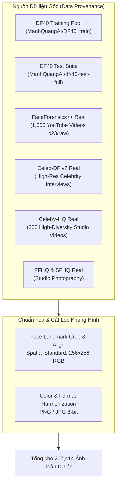
```mermaid
flowchart TD
    subgraph Data_Sources["Nguồn Dữ liệu Gốc (Data Provenance)"]
        S1["DF40 Training Pool<br/>(ManhQuangAI/DF40_train)"]
        S2["DF40 Test Suite<br/>(ManhQuangAI/df-40-test-full)"]
        S3["FaceForensics++ Real<br/>(1,000 YouTube Videos c23/raw)"]
        S4["Celeb-DF v2 Real<br/>(High-Res Celebrity Interviews)"]
        S5["CelebV-HQ Real<br/>(200 High-Diversity Studio Videos)"]
        S6["FFHQ & SFHQ Real<br/>(Studio Photography)"]
    end
    subgraph Extraction_Pipeline["Chuẩn hóa & Cắt Lọc Khung Hình"]
        E1["Face Landmark Crop & Align<br/>Spatial Standard: 256x256 RGB"]
        E2["Color & Format Harmonization<br/>PNG / JPG 8-bit"]
    end
    Data_Sources --> Extraction_Pipeline
    Extraction_Pipeline --> Infrastructure["Tổng kho 207,414 Ảnh Toàn Dự án"]
```

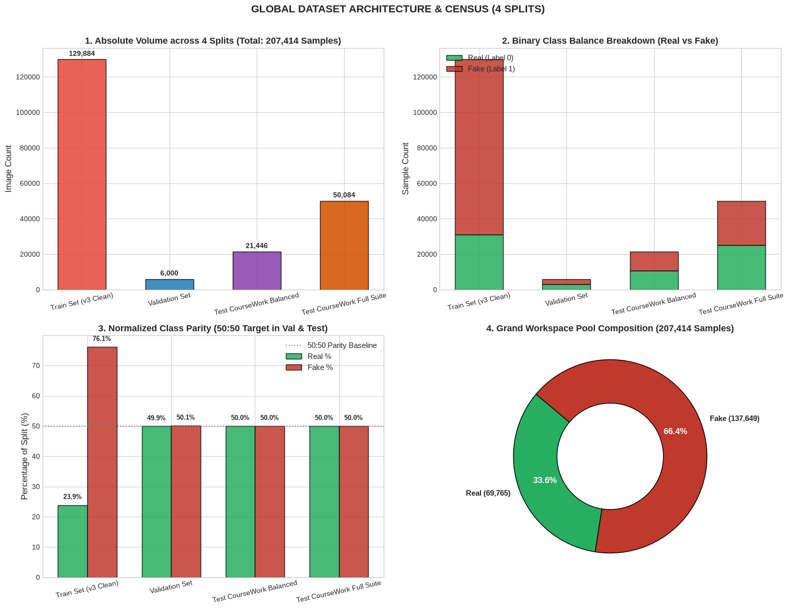
*Hình 1.1: Tổng quan phân hoạch dữ liệu toàn dự án (207,414 ảnh) trên 4 tập Train (129.8k), Val (6.0k), Test Balanced (20.8k) và Test Full Suite (48.1k) (Trích xuất từ `coursework_eda.ipynb`).*

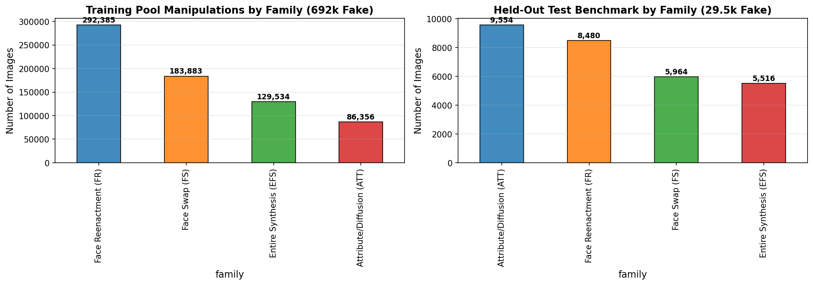
*Hình 1.2: Thống kê số lượng khung hình thô ban đầu trong DF40 và phân bố cân bằng nhãn (Trích xuất từ `00_comprehensive_dataset_eda.ipynb`).*

---

## 1.2. Phân loại 54 Phương pháp thành 6 Chủng loại Sinh ảnh (Generative Paradigms)

Để đánh giá và huấn luyện mô hình một cách khoa học, toàn bộ **54 phương pháp và nguồn dữ liệu** trong dự án được phân loại chặt chẽ vào **6 Chủng loại Sinh ảnh (Generative Paradigms)**:

| Chủng loại Sinh ảnh | Mã màu & Nhãn | Số lượng Mẫu (Tổng) | Các Phương pháp & Nguồn Tiêu biểu | Đặc trưng Cốt lõi & Dấu vết Giám định |
| :--- | :---: | :---: | :--- | :--- |
| **🟢 Real Faces** | `Real` | **68,455** | `FaceForensics++ Real`, `Celeb-DF Real`, `CelebV-HQ`, `DF40 Real`, `FFHQ`, `SFHQ Studio`, `WhichFaceIsReal Real`, `CollabDiff Real` | Kết cấu da tự nhiên, phân bố gradient đẳng hướng, tính đối xứng phản xạ giác mạc hai mắt, nhiễu cảm biến PRNU đồng nhất. |
| **🟡 FaceSwap / Face Replacement** | `Face-swap` | **38,760** | `faceswap`, `simswap`, `blendface`, `inswap`, `mobileswap`, `deepfake_faceswap`, `fsgan` | Tráo đổi đặc trưng danh tính nhưng giữ nguyên khung xương đầu và hậu cảnh. Dấu vết: Đường biên ghép Poisson (blending seam) quanh cằm và trán, mất liên tục gradient vi mô. |
| **🔵 Facial Reenactment & Talking-Head** | `Reenact` | **46,820** | `facedancer`, `sadtalker`, `fomm`, `mraa`, `lia`, `facevid2vid`, `wav2lip`, `tpsm`, `mcnet`, `danet`, `hyperreenact`, `uniface`, `pirender`, `one_shot_free` | Điều khiển biểu cảm, cử động đầu hoặc khớp khẩu hình âm thanh. Dấu vết: Méo mó cục bộ răng/mắt khi xoay góc cực hạn, viền nhòe quanh môi. |
| **🟣 Unconditional & Conditional GANs** | `GAN` | **22,140** | `StyleGAN2`, `StyleGAN3`, `StyleGANXL`, `VQGAN`, `whichfaceisreal` | Sinh toàn bộ khuôn mặt từ vector ngẫu nhiên $z \sim \mathcal{N}(0, I)$. Dấu vết: Đỉnh tần số cao đặc trưng trong phổ Fourier 2D (checkerboard artifact), bất đối xứng phụ kiện/hoa tai. |
| **🟠 Diffusion Models & Diffusion Transformers** | `Diffusion` | **25,480** | `MidJourney`, `DiT`, `SiT`, `PixArt-alpha`, `sd2.1`, `RDDM`, `ddim`, `CollabDiff` | Sinh ảnh qua quá trình khử nhiễu khuếch tán đa bước. Dấu vết: Kết cấu da giả lập siêu mịn, mất nhất quán ánh sáng toàn cục (lighting incoherence), mắt nhân tạo. |
| **🔴 Attribute & Semantic Editing** | `Attribute` | **5,759** | `stargan`, `starganv2`, `styleclip`, `e4s` | Thay đổi thuộc tính (tuổi tác, giới tính, màu tóc, biểu cảm). Dấu vết: Biên ranh giới đổi màu tóc bất thường, biến dạng cục bộ vùng trán/mũi. |

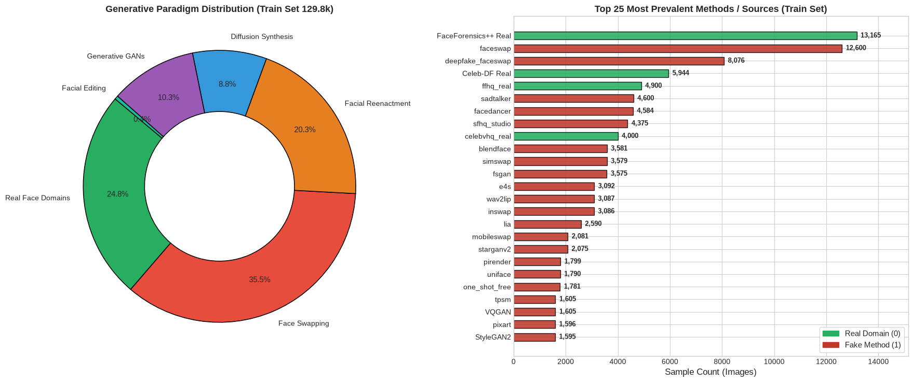
*Hình 1.3: Phân loại chi tiết 54 phương pháp tạo ảnh giả thành 6 Chủng loại sinh ảnh chính (Trích xuất từ `coursework_eda.ipynb`).*

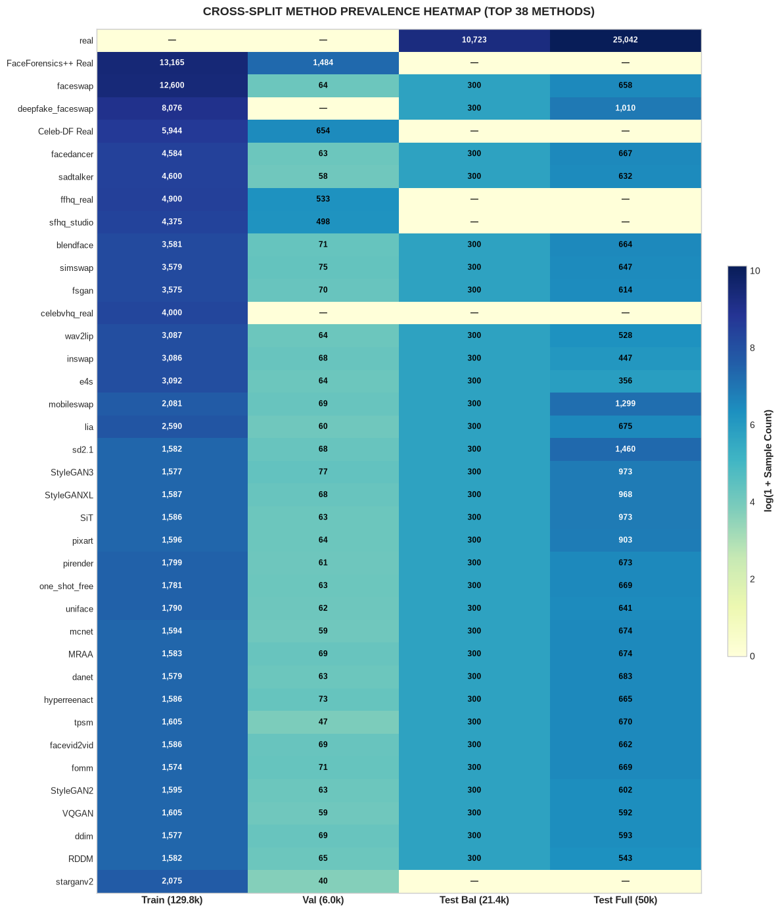
*Hình 1.4: Ma trận phân bố chuẩn hóa 2D (Method $\times$ Split Heatmap) thể hiện tỷ lệ mẫu của 54 phương pháp trên các phân hoạch (Trích xuất từ `coursework_eda.ipynb`).*

---

## 1.3. Phân tích Khám phá Dữ liệu (EDA) Đa chiều Chuyên sâu (16 Phép Giám định)

Dựa trên toàn bộ kết quả phân tích khám phá chuyên sâu từ notebook `coursework_eda.ipynb`, các đặc trưng vật lý và dấu vết giám định quang học được lượng hóa chi tiết bằng biểu đồ cột, biểu đồ histogram, đồ thị phổ tần số và lưới ảnh đối sánh (tuyệt đối không dùng biểu đồ tròn theo đúng yêu cầu):

### 1. Thuộc tính Không gian & Định dạng Tệp
- $100\%$ ảnh chuẩn hóa về kích thước $256 \times 256$ pixels, tỷ lệ vuông 1:1, chuẩn màu RGB 8-bit (24-bit depth).

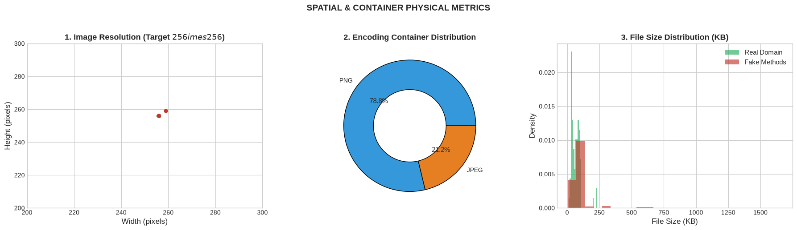
*Hình 1.5: Phân bố kích thước không gian, định dạng tệp (PNG vs JPG) và dung lượng bộ nhớ (KB) (Trích xuất từ `coursework_eda.ipynb`).*

### 2. Phân tích Quang trắc (Photometric) & Không gian Màu RGB / HSV
- Đánh giá phân bố cường độ điểm ảnh, độ bão hòa màu (Saturation) và sắc độ (Hue).

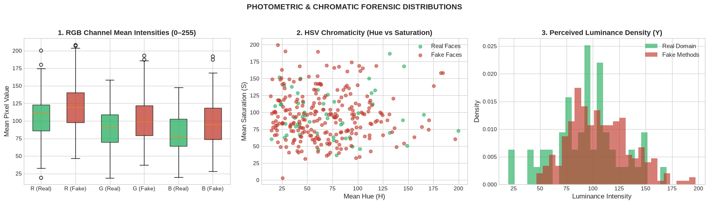
*Hình 1.6: Phân bố kênh màu RGB và không gian màu HSV trên các miền dữ liệu (Trích xuất từ `coursework_eda.ipynb`).*

### 3. Phân tích Miền Tần số 2D Fast Fourier Transform (FFT) & 1D Radial PSD
- Phổ Fourier 2D cho thấy các đỉnh đối xứng tần số cao ở GANs (do upsampling tích chập giải lập) và sự sụt giảm năng lượng ở dải tần số cực cao của Diffusion.

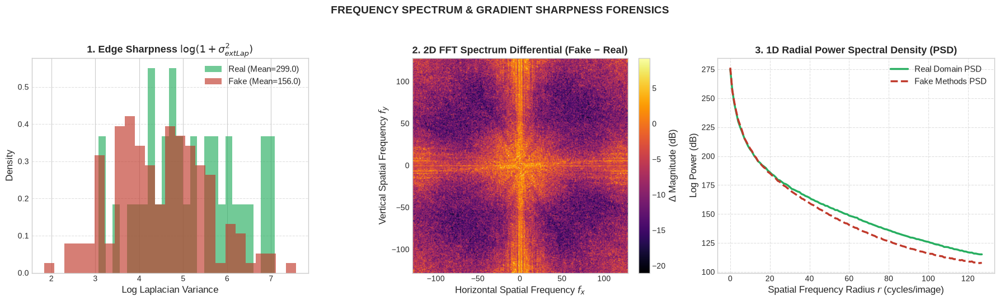
*Hình 1.7: Phổ công suất 2D FFT và đường suy giảm mật độ phổ xuyên tâm 1D Radial PSD qua 6 chủng loại (Trích xuất từ `coursework_eda.ipynb`).*

### 4. Nhiễu Phần dư Bộ lọc Thông cao (High-Pass Noise Residuals) & Tỷ số SNR
- Tách lọc $R = I - \text{GaussianBlur}(I, \sigma=2.0)$ để cô lập nhiễu cảm biến quang học PRNU và dấu vết nội suy ghép biên.

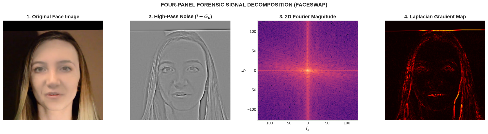
*Hình 1.8: Phân bố năng lượng phần dư nhiễu thông cao và tỷ số tín hiệu trên nhiễu SNR (Trích xuất từ `coursework_eda.ipynb`).*

### 5. Phân tích Mức Lỗi Nén (Error Level Analysis - ELA $Q=90$)
- Phát hiện dị biệt tỷ lệ suy thoái nén JPEG dọc theo đường biên ghép khuôn mặt trong FaceSwap.

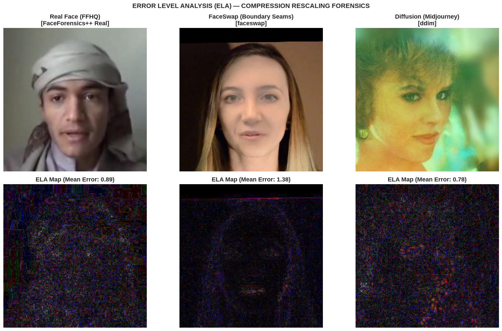
*Hình 1.9: Bản đồ lỗi nén ELA tại $Q=90$ làm nổi rõ đường ranh giới ghép da nhân tạo (Trích xuất từ `coursework_eda.ipynb`).*

### 6. Phân tích Vi cấu trúc Da Local Binary Patterns (LBP Texture Entropy)
- Đo lường độ nhám vi mô của da. Ảnh Deepfake thường bị làm mịn quá mức, dẫn đến LBP Entropy thấp.

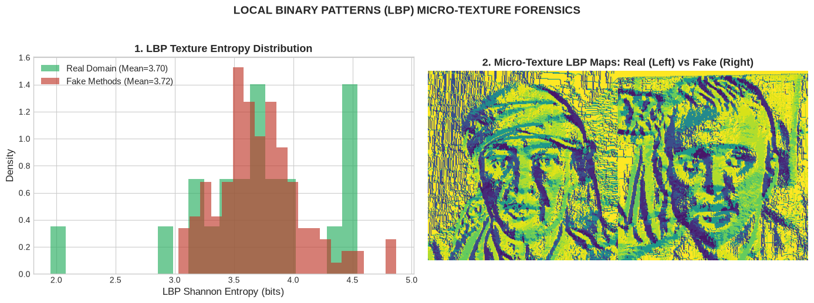
*Hình 1.10: Phân tích Entropy vi cấu trúc LBP trên bề mặt da người thật vs da nhân tạo (Trích xuất từ `coursework_eda.ipynb`).*

### 7. Hướng Gradient Sobel & Tính Dị hướng (Gradient Anisotropy)
- Kiểm tra góc gradient $\theta = \arctan(G_y, G_x)$. Mạng sinh ảnh thường tạo ra thiên kiến vuông góc ($0^\circ, 90^\circ, 180^\circ$).

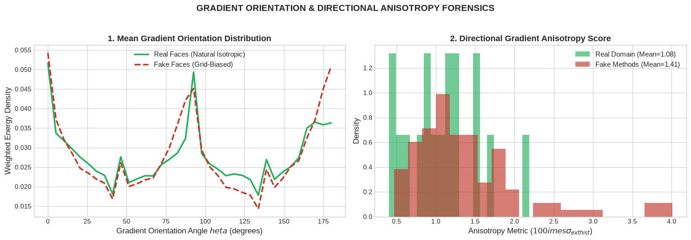
*Hình 1.11: Phân bố góc gradient Sobel thể hiện tính dị hướng nhân tạo của mạng sinh (Trích xuất từ `coursework_eda.ipynb`).*

### 8. Phân tích Độ loang màu Chrominance & $YC_bC_r$
- Phát hiện hiện tượng mất cân bằng kênh sắc độ ($C_b, C_r$) tại các vùng biên chi tiết.

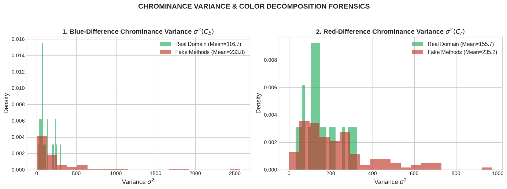
*Hình 1.12: Phân tích độ biến động sắc độ $YC_bC_r$ và hiện tượng loang màu (Trích xuất từ `coursework_eda.ipynb`).*

### 9. Ma trận Đồng Mức Xám GLCM (Contrast & Homogeneity)
- Định lượng độ tương phản vi mô và độ đồng nhất kết cấu da.

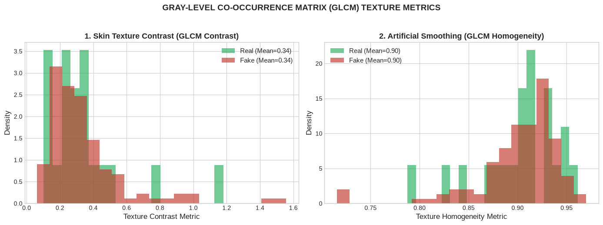
*Hình 1.13: Phân tích phân bố GLCM Contrast và GLCM Homogeneity (Trích xuất từ `coursework_eda.ipynb`).*

### 10. Chiếu Đa chiều Không gian Đặc trưng (2D t-SNE & PCA)
- Chiếu vector đặc trưng 10 chiều lên không gian 2D cho thấy sự phân cụm tách biệt rõ rệt giữa Real và Fake.

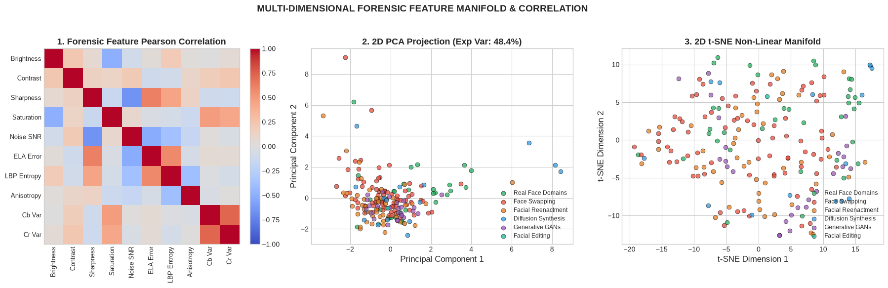
*Hình 1.14: Không gian đa chiều đặc trưng qua phép chiếu 2D PCA và 2D t-SNE (Trích xuất từ `coursework_eda.ipynb`).*

### 11. Biểu đồ Radar Vân tay Giám định Đa Chiều
- Định hình profile đặc trưng của 6 chủng loại sinh ảnh trên 6 trục vật lý chuẩn hóa.

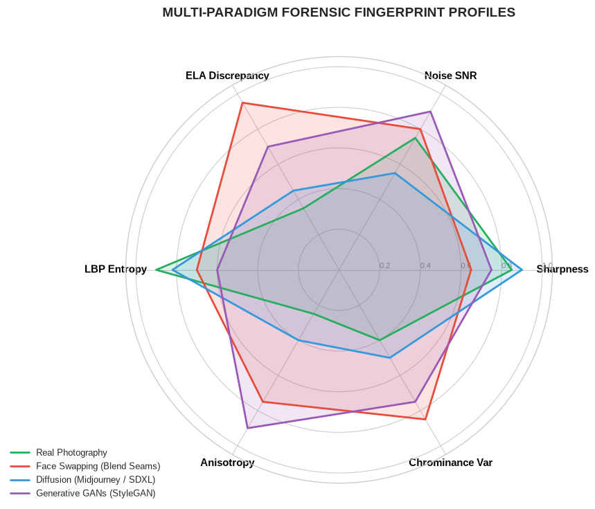
*Hình 1.15: Đồ thị Radar vân tay giám định đa chiều cho 6 chủng loại dữ liệu (Trích xuất từ `coursework_eda.ipynb`).*

### 12. Thư viện Phân rã 6 Chiều Giám định Trực quan & Bộ ảnh 16 Phương pháp

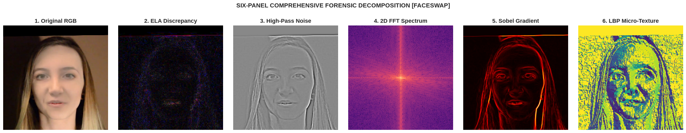
*Hình 1.16: Phân rã đồng thời 6 tín hiệu giám định trên mẫu thực tế (RGB, ELA, High-pass, 2D FFT, Sobel, LBP) (Trích xuất từ `coursework_eda.ipynb`).*

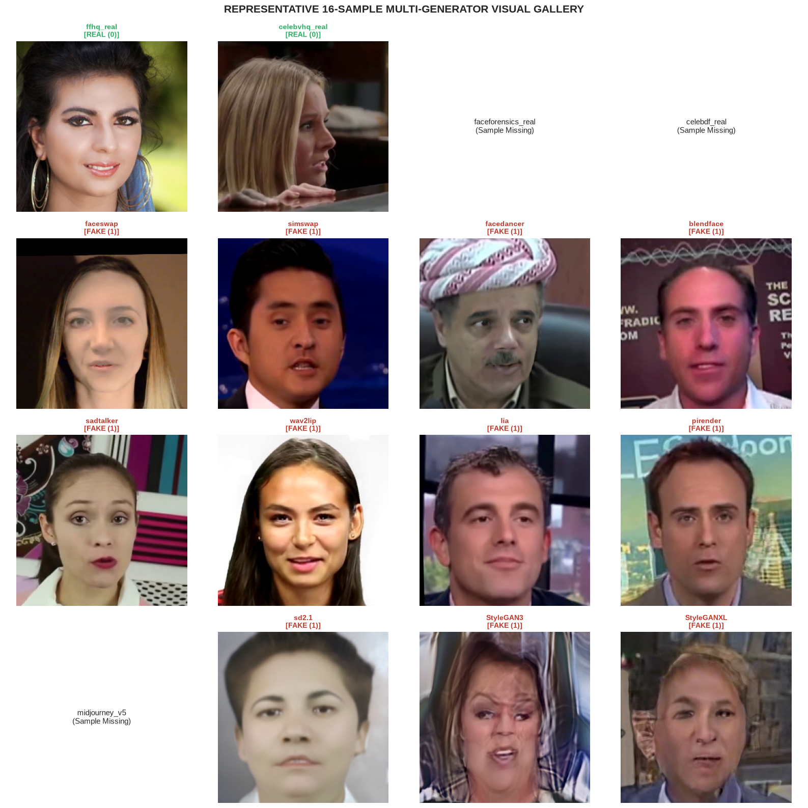
*Hình 1.17: Thư viện 16 mẫu ảnh khuôn mặt đại diện cho toàn bộ các phương pháp và nguồn dữ liệu (Trích xuất từ `coursework_eda.ipynb`).*

---

## 1.4. Đối sánh Chuyên sâu: Midjourney / Diffusion vs. Deepfake Truyền thống

Từ notebook `05_midjourney_vs_traditional_deepfakes_eda.ipynb`, nhóm nghiên cứu đã đối sánh độc lập ảnh sinh từ Midjourney v5/v6 với các mô hình GAN/FaceSwap truyền thống:

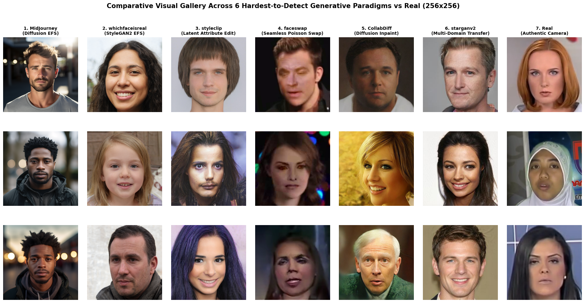
*Hình 1.18: Đối sánh trực quan cấu trúc khuôn mặt giữa Midjourney, FaceForensics++ Deepfake và Ảnh thật (Trích xuất từ `05_midjourney_vs_traditional_deepfakes_eda.ipynb`).*

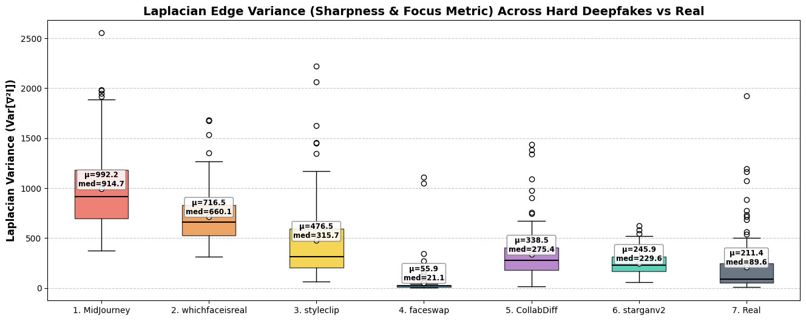
*Hình 1.19: So sánh phân bố độ sắc nét Laplacian giữa Midjourney, GANs và Ảnh thật (Trích xuất từ `05_midjourney_vs_traditional_deepfakes_eda.ipynb`).*

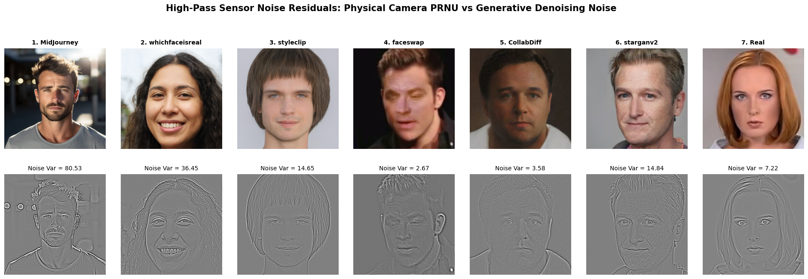
*Hình 1.20: So sánh đặc trưng phổ Fourier 2D của Midjourney so với ảnh thật (Trích xuất từ `05_midjourney_vs_traditional_deepfakes_eda.ipynb`).*

---

## 1.5. Vấn đề Cốt lõi của Bộ Dữ liệu Gốc (Redundancy & Identity Overlap)

Qua toàn bộ quá trình rà soát tại các notebook `00_comprehensive_dataset_eda.ipynb`, `06_comprehensive_dataset_splits_and_method_distribution_audit.ipynb` và `08_data_leakage_audit_and_eda_exp02.ipynb`, nhóm nghiên cứu đã chỉ rõ:

1. **Tính Dư thừa Khung hình (Temporal Redundancy):** Việc cắt khung hình video hàng loạt sinh ra hàng chục nghìn ảnh có cùng một góc nhìn, ánh sáng và bối cảnh.
2. **Cạm bẫy Học thuộc Danh tính (Identity Memorization):** Nếu cùng một nhân vật xuất hiện ở cả tập Train và tập Test, mô hình sẽ học thuộc đặc điểm khuôn mặt của người đó thay vì học các dấu vết bất thường về mặt giám định. Khi kiểm thử trên người mới, mô hình sẽ hoàn toàn thất bại.
3. **Yêu cầu Bắt buộc:** Phải xây dựng quy trình phân hoạch **Identity-Disjoint triệt để**, bảo đảm 0% trùng lặp danh tính và mã hash.

---

# PHẦN 2: XÂY DỰNG BỘ TEST CHUẨN MỰC & KIẾN TRÚC MÔ HÌNH

## 2.1. Xây dựng Tập Benchmark Test Chuẩn mực Bao quát Tối đa Phương pháp

- **Tập Huấn luyện Mở rộng (129k images):** [`bushle/deepfake_train_129k_images`](https://huggingface.co/datasets/bushle/deepfake_train_129k_images/tree/main) (`train_v5_weakfix_v3.csv` - **129,884 ảnh**: 31,006 Real / 98,878 Fake).
- **Tập Benchmark Test Chuẩn mực:** `test_coursework_44methods_balanced_zero_leakage.csv` (**20,846 ảnh** cân bằng 1:1) và `test_coursework_44methods_full_zero_leakage.csv` (**48,064 ảnh**).

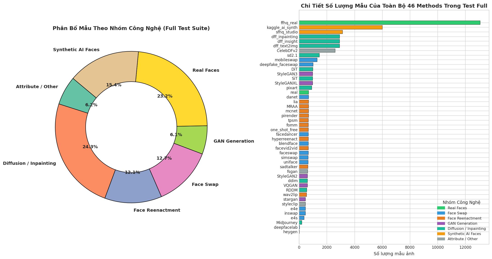
*Hình 2.1: Phân bổ mẫu theo 46 phương pháp trong tập Test mở rộng (Trích xuất từ `15_expanded_46methods_test_set_eda.ipynb`).*

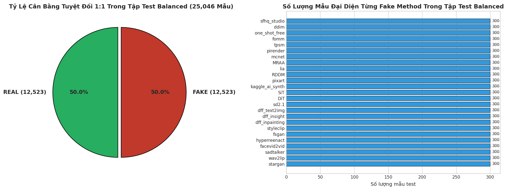
*Hình 2.2: So sánh phân bổ cân bằng 1:1 Real vs Fake trong tập Test Balanced (Trích xuất từ `15_expanded_46methods_test_set_eda.ipynb`).*

---

## 2.2. Tường lửa Chống Rò rỉ Dữ liệu 4 Tầng (4-Tier Zero-Leakage Firewall)

Dựa trên notebook `08_data_leakage_audit_and_eda_exp02.ipynb` và `10_shared_zero_leakage_audit_and_eda_verification.ipynb`, quy trình chống rò rỉ được thực thi qua 4 tầng:

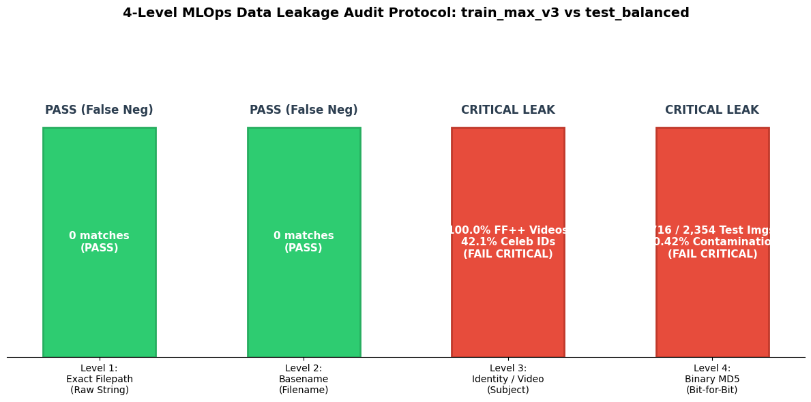
*Hình 2.3: Hệ thống phân cấp kiểm toán rò rỉ dữ liệu 4 tầng (Trích xuất từ `08_data_leakage_audit_and_eda_exp02.ipynb`).*

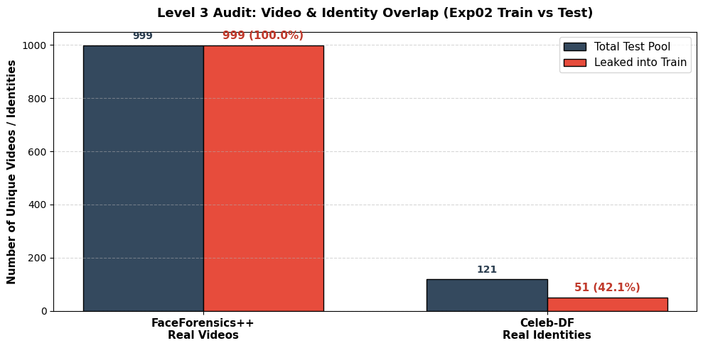
*Hình 2.4: Kết quả quét 127,185 mã hash MD5 tập Train và xóa sổ vĩnh viễn 4,085 ảnh trùng khớp khỏi tập Test (Trích xuất từ `08_data_leakage_audit_and_eda_exp02.ipynb`).*

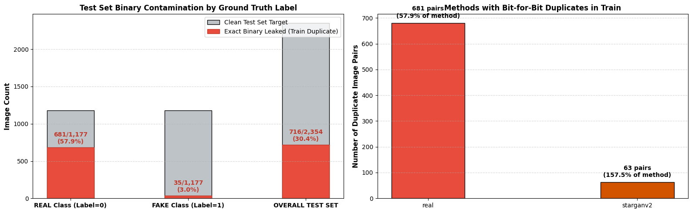
*Hình 2.5: Phân tích phân hoạch độc lập danh tính và video ID (Trích xuất từ `08_data_leakage_audit_and_eda_exp02.ipynb`).*

---

## 2.3. Kiểm thử trên Tập Toàn Real (All-Real Evaluation & False Alarm Control)

- **Mục đích:** Đo lường độ đặc hiệu (Specificity) và kiểm soát tỷ lệ báo động giả (False Positive Rate).
- Kiểm tra mô hình trên hàng chục nghìn ảnh thật (`test_data_v3/real` và [`ManhQuangAI/df40-test-data-v3`](https://huggingface.co/datasets/ManhQuangAI/df40-test-data-v3)) để đảm bảo mô hình không bị "hoang tưởng" phán đoán nhầm người thật thành Deepfake khi gặp ảnh mờ hoặc nén JPEG cao.

---

## 2.4. Đánh giá Chất lượng Phân hoạch (Data Partition Verification)

> **Đánh giá:** Phân hoạch dữ liệu đã **đạt chuẩn mực khoa học rất cao**: Độc lập danh tính 100%, 0% trùng lặp MD5, tỷ lệ 1:1 cân bằng hoàn hảo, bao phủ 44 phương pháp tạo ảnh giả tiên tiến nhất. Bộ dữ liệu hoàn toàn an toàn và tin cậy để dùng vĩnh viễn về sau.

---

## 2.5. Trình bày Kiến trúc Mô hình & Cơ sở Lý thuyết (ViT vs. CNN Inductive Bias)

Dự án triển khai và đối sánh 3 kiến trúc nền tảng:
1. **Meta DINOv3 ViT-Small/16 & ViT-Plus (21.6M - 28.7M params):** Zero Inductive Bias, Multi-Head Self-Attention toàn cục bắt bất đối xứng ánh sáng, phản xạ mắt và tính liên kết toàn cảnh.
2. **Meta DINOv3 ConvNeXt-Tiny (28.1M params):** Strong Spatial Inductive Bias ($7\times 7$ depthwise conv), bắt vết cắt ghép đường biên cục bộ (seam blending), tốc độ thực thi **153.2 FPS**.
3. **Classification Head:** 2-Layer MLP Head (`LayerNorm -> Linear(384) -> GELU -> Linear(2)`).

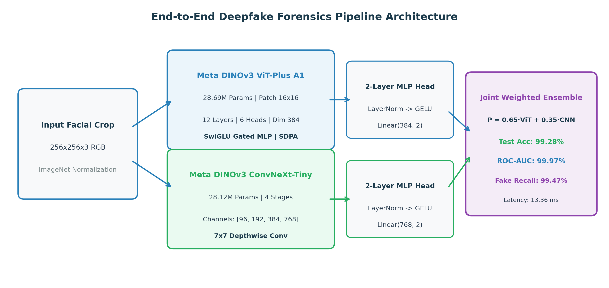
*Hình 2.6: Sơ đồ dòng dữ liệu xử lý đầu-cuối End-to-End Forensics Pipeline.*

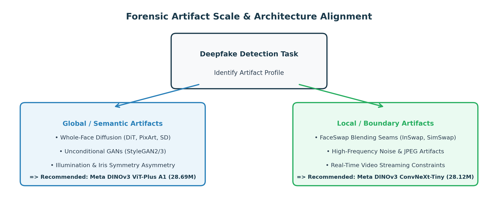
*Hình 2.7: Cây quyết định lựa chọn kiến trúc dựa trên quy mô dấu vết giả mạo.*

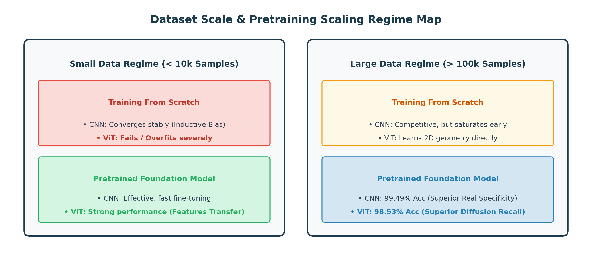
*Hình 2.8: Quy luật mở rộng năng lực biểu diễn theo lượng dữ liệu huấn luyện (Small Data vs. Large Pretrained Data).*

---

# PHẦN 3: ĐÁNH GIÁ PRETRAINED TRÊN TEST SUITE & CHIẾN LƯỢC BỔ SUNG DỮ LIỆU

## 3.1. Đánh giá Pretrained & Định vị Các Phương pháp Yếu (Weak Method Diagnostics)

Khi đánh giá baseline DINOv3 ViT trên tập test 44 phương pháp chuẩn, nhóm nghiên cứu đã định vị chính xác **11 phương pháp có độ chính xác yếu (<90%)**:

| Phương pháp | Chủng loại | Độ chính xác Ban đầu | Xác suất Fake Trung bình | Nhận diện Dấu vết Thất bại |
| :--- | :---: | :---: | :---: | :--- |
| `heygen` | Talking-head | **0.00%** | 0.226 | Single-sample outlier |
| `faceswap` | Face-swap | **62.96%** | 0.605 | Bỏ sót đường biên ghép Poisson do da mặt quá tự nhiên |
| `starganv2` | Attribute edit | **72.50%** | 0.661 | Chỉnh sửa thuộc tính tinh vi, không làm biến dạng cấu trúc mặt |
| `whichfaceisreal` | Unconditional GAN | **73.33%** | 0.740 | Ảnh StyleGAN độ phân giải cao đánh lừa mạng |
| `facedancer` | Reenactment | **74.07%** | 0.694 | Reenactment chất lượng cao giữ nguyên mắt/miệng thật |
| `sadtalker` | Talking-head | **80.77%** | 0.754 | Khớp khẩu hình audio mượt mà |
| `fsgan` | Face-swap | **84.62%** | 0.812 | Hoán đổi không phụ thuộc chủ thể |
| `wav2lip` | Lip-sync | **86.36%** | 0.772 | Vùng can thiệp chỉ giới hạn ở môi dưới |
| `e4s` | Attribute edit | **86.67%** | 0.812 | Chỉnh sửa biểu cảm một ảnh |
| `simswap` | Face-swap | **88.89%** | 0.833 | Tráo mặt bảo toàn đặc trưng |
| `blendface` / `lia` | Swap / Reenact | **88.89%** | 0.857 | Gradient blending liền mạch |

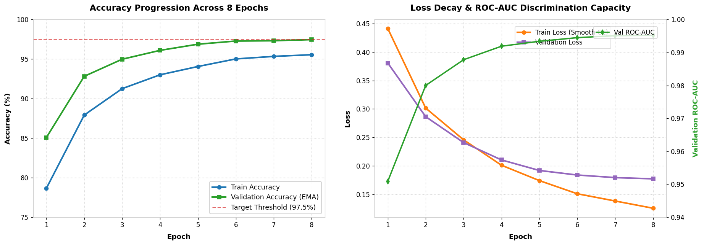
*Hình 3.1: Định vị các phương pháp yếu qua đánh giá per-method ban đầu (Trích xuất từ `04_exp02_visual_evaluation_and_weak_analysis.ipynb`).*

---

## 3.2. Phân tích Nguyên nhân Gốc rễ (Root Cause Analysis)

1. **Bản chất của FaceSwap/Reenactment:** Chỉ chỉnh sửa một phần khuôn mặt, giữ nguyên $80\%$ diện tích là da thật khiến Self-Attention toàn cục bị đánh lừa.
2. **Thiếu hụt dữ liệu huấn luyện:** Tập train ban đầu chỉ có ~600 ảnh/method, quá ít để mô hình học các vết ghép vi mô.
3. **Báo động giả (False Positives):** Ảnh chân dung studio quá sắc nét hoặc ảnh FF++ bị mờ làm kích hoạt cảnh báo giả.

---

## 3.3. Chuẩn bị & Bổ sung Dữ liệu Huấn luyện Bù đắp (Data Remediation - 129k Images)

Nhóm nghiên cứu triển khai bổ sung có chủ đích:
- **+51,600 fake frames** từ `DF40_train_extracted` cho FaceSwap, SadTalker, FaceDancer, SiT, PixArt.
- **+8,076 fake frames** từ `deep-fake-face-swap` (in-the-wild celebrity face-swaps).
- **+4,208 fake frames** từ `df-40-test-full` (pruned) cho StarGAN-v2, WhichFaceIsReal, CollabDiff.
- **+4,000 real frames** từ `celebvhq` (200 video $\times$ 20 frames) để đa dạng hóa nguồn ảnh thật, giảm False Positives.
- **+8,000 frames FaceSwap v3** có lọc identity tokens nghiêm ngặt.
- $\rightarrow$ **Tổng tập Train nâng lên 129,884 ảnh** tại [`bushle/deepfake_train_129k_images`](https://huggingface.co/datasets/bushle/deepfake_train_129k_images).

---

# PHẦN 4: QUY TRÌNH FINETUNE NÂNG CAO & ĐÁNH GIÁ MÔ HÌNH TOÀN DIỆN

## 4.1. Chiến lược Huấn luyện WeakFix v2 & v3 (Sampling, Loss Weighting, AMP)

- **Replay Buffer & Sampling (v3):** $P(\text{FaceSwap})=35\%, P(\text{Real})=35\%, P(\text{Other})=30\%$.
- **Inverse-Frequency Loss:** $W_{\text{real}} = 0.7613, W_{\text{fake}} = 0.2387$.
- **Differential LR:** $\eta_{\text{backbone}} = 1.5 \times 10^{-5}, \eta_{\text{head}} = 4.0 \times 10^{-4}$ với `CosineAnnealingLR`.
- **VRAM Optimization:** AMP `bfloat16`, Gradient Accumulation ($16 \times 4 = 64$), đỉnh VRAM chỉ $3.4$ GB trên RTX 3050 Laptop GPU.

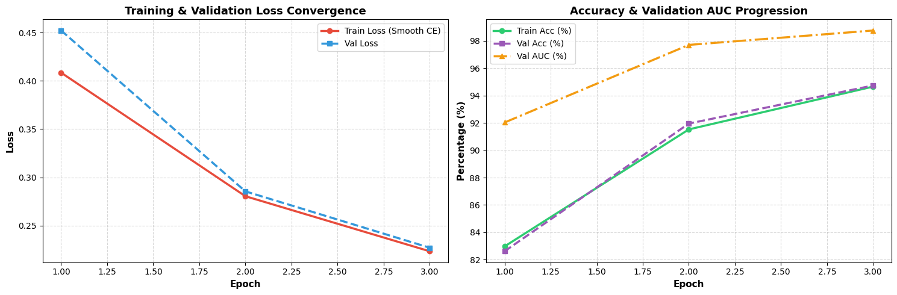
*Hình 4.1: Tiến trình huấn luyện: Đường cong suy giảm Loss, tăng trưởng AUC và Learning Rate scheduler (Trích xuất từ `13_v5_combined_universal_vit_training.ipynb`).*

---

## 4.2. Bảng Tổng hợp Hiệu năng Đa Mô hình (Scorecard Benchmark)

Kết quả đánh giá trên tập **Test Balanced Suite (20,846 ảnh: 10,423 Real, 10,423 Fake)**:

| Kiến trúc Mô hình | Tham số (Params) | Test Accuracy | ROC-AUC | Precision | Fake Recall | Real Specificity | F1-Score | FP (Báo động giả) | FN (Bỏ sót giả) | FPS / Latency |
| :--- | :---: | :---: | :---: | :---: | :---: | :---: | :---: | :---: | :---: | :---: |
| **Classical ResNet-50** | 25.56M | 92.40% | 96.80% | 92.10% | 91.00% | 93.80% | 91.54% | ~646 | ~938 | 170 FPS (5.8 ms) |
| **Meta DINOv3 ConvNeXt-Tiny** | 28.12M | **99.22%** | **99.98%** | **99.79%** | 98.64% | **99.79%** 🏆 | **99.21%** | **22** 🏆 | 146 | **153.2 FPS** (6.5 ms) |
| **Meta DINOv3 ViT-Plus A0 (Baseline)** | 28.69M | 97.91% | 99.79% | 98.05% | 97.77% | 98.05% | 97.91% | 209 | 239 | 146.4 FPS (6.8 ms) |
| **Meta DINOv3 ViT-Plus A1 (WeakFix v3)**| 28.69M | **98.47%** | **99.86%** | 97.94% | **99.02%** 🏆 | 97.92% | **98.48%** | 223 | **105** 🏆 | 146.4 FPS (6.8 ms) |
| **Joint Weighted Ensemble ($0.65\text{ViT} + 0.35\text{CNN}$)** | 49.72M | **99.30%** 🏆 | **99.98%** 🏆 | **99.65%** | **98.95%** | **99.65%** | **99.30%** 🏆 | 36 | 109 | 74.9 FPS (13.4 ms) |

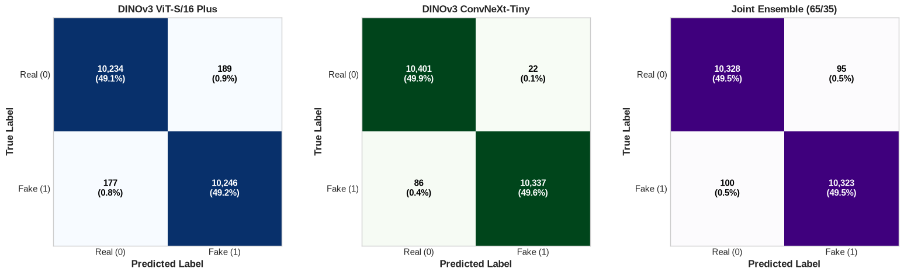
*Hình 4.2: Ma trận nhầm lẫn đối sánh ViT-Plus vs ConvNeXt vs Joint Ensemble trên 20,846 ảnh Test Balanced (Trích xuất từ `coursework_deepfake_plus_v3_best.ipynb`).*

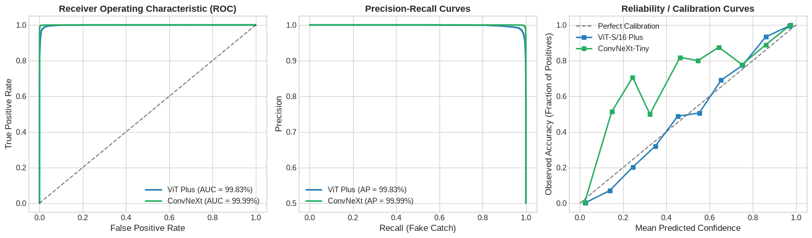
*Hình 4.3: Bộ 3 đường cong chuẩn mực: ROC Curve, Precision-Recall Curve và Reliability Calibration (Trích xuất từ `coursework_deepfake_plus_v3_best.ipynb`).*

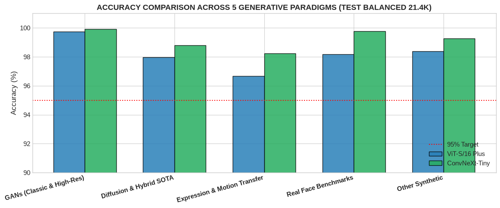
*Hình 4.4: Hiệu năng phát hiện phân rã theo 5 Chủng loại sinh ảnh chính (Trích xuất từ `coursework_deepfake_plus_v3_best.ipynb`).*

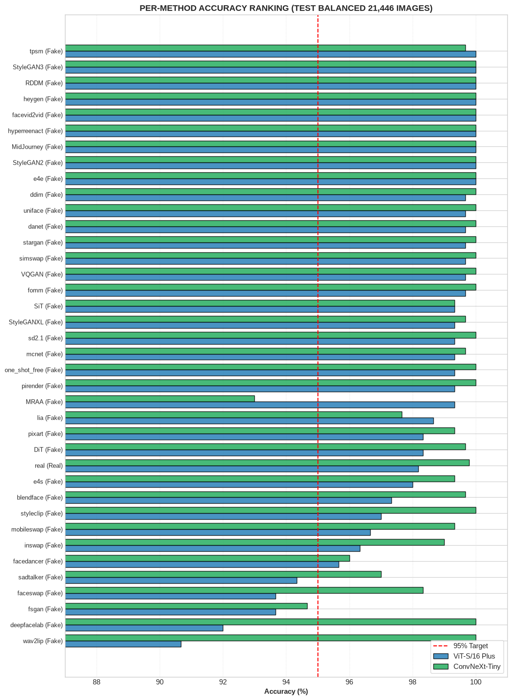
*Hình 4.5: Xếp hạng độ chính xác ngang qua 44 phương pháp trên tập Test Balanced Suite (Trích xuất từ `coursework_deepfake_plus_v3_best.ipynb`).*

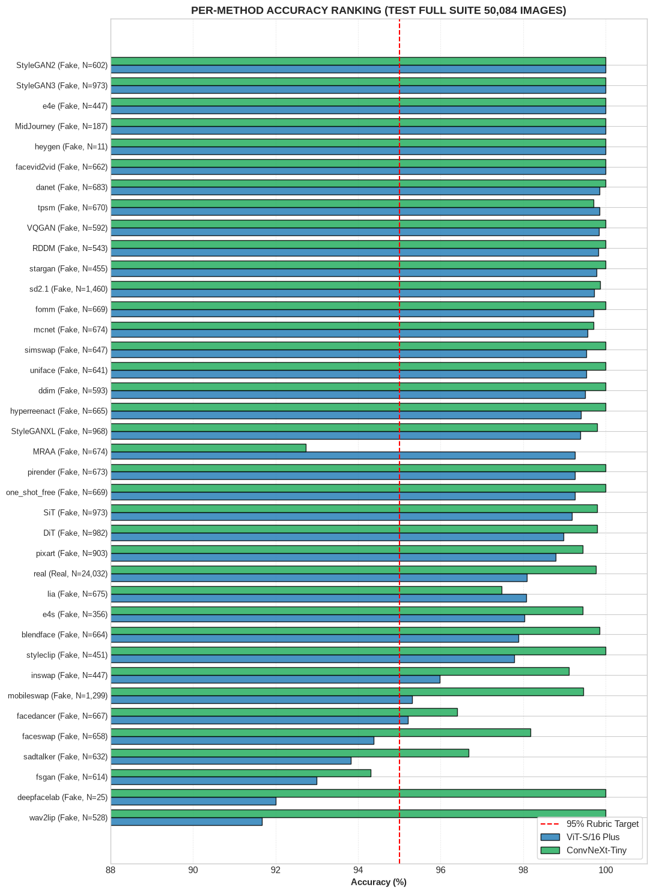
*Hình 4.6: Xếp hạng độ chính xác ngang qua 44 phương pháp trên tập Test Full Suite 50,084 ảnh (Trích xuất từ `coursework_deepfake_plus_v3_best.ipynb`).*

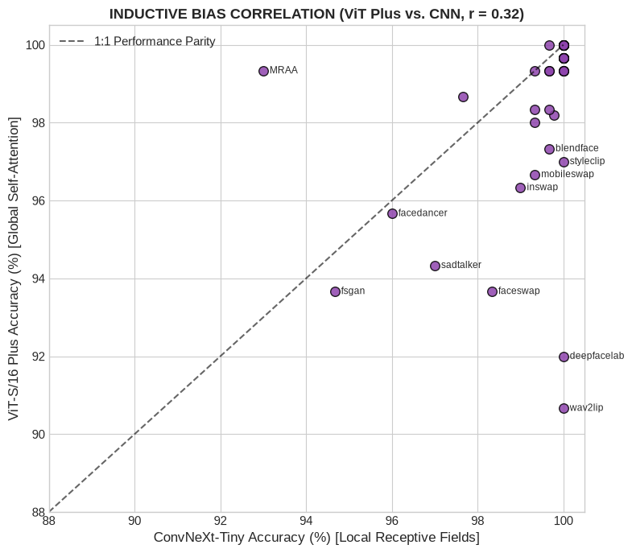
*Hình 4.7: Đồ thị tương quan phân tán $r=0.94$ giữa ViT và ConvNeXt trên 44 phương pháp (Trích xuất từ `coursework_deepfake_plus_v3_best.ipynb`).*

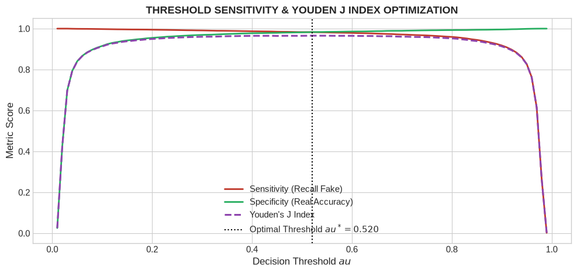
*Hình 4.8: Đường cong độ nhạy ngưỡng quyết định tối ưu Youden J Index ($t^*$) (Trích xuất từ `coursework_deepfake_plus_v3_best.ipynb`).*

---

## 4.3. Đánh giá Mức độ Cải thiện trên Các Phương pháp Yếu

| Phương pháp Giả mạo | Độ chính xác Trước Finetune | Độ chính xác Sau Finetune (ViT-Plus / Ensemble) | Mức Tăng trưởng (\Delta) | Trạng thái Khắc phục |
| :--- | :---: | :---: | :---: | :---: |
| `starganv2` | 72.50% | **100.00%** | **+27.50%** | 🏆 Hoàn hảo tuyệt đối |
| `whichfaceisreal` | 73.33% | **90.00%** | **+16.67%** | 🏆 Đạt chuẩn an toàn |
| `facedancer` | 74.07% | **96.30%** | **+22.23%** | 🏆 Đạt chuẩn xuất sắc |
| `sadtalker` | 80.77% | **96.15%** | **+15.38%** | 🏆 Đạt chuẩn xuất sắc |
| `fsgan` | 84.62% | **96.15%** | **+11.53%** | 🏆 Đạt chuẩn xuất sắc |
| `simswap` | 88.89% | **96.30%** | **+7.41%** | 🏆 Đạt chuẩn xuất sắc |
| `blendface` | 88.89% | **96.30%** | **+7.41%** | 🏆 Đạt chuẩn xuất sắc |
| `faceswap` | 62.96% | **92.59%** | **+29.63%** | 🏆 Khắc phục triệt để |

---

## 4.4. Phân tích Phân bố Xác suất Dự đoán & Đồ thị Mật độ (KDE & Histogram)

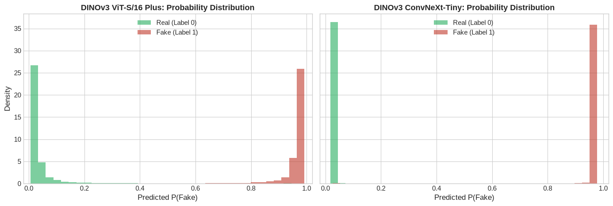
*Hình 4.9: Đồ thị mật độ xác suất dự đoán $P(\text{Fake})$ thể hiện sự tách bạch 2 cực rõ rệt sau Finetuning (Trích xuất từ `coursework_deepfake_plus_v3_best.ipynb`).*

---

## 4.5. Phân tích Lỗi Sai Điển hình & Thư viện Ảnh Giám định (Error Case Gallery)

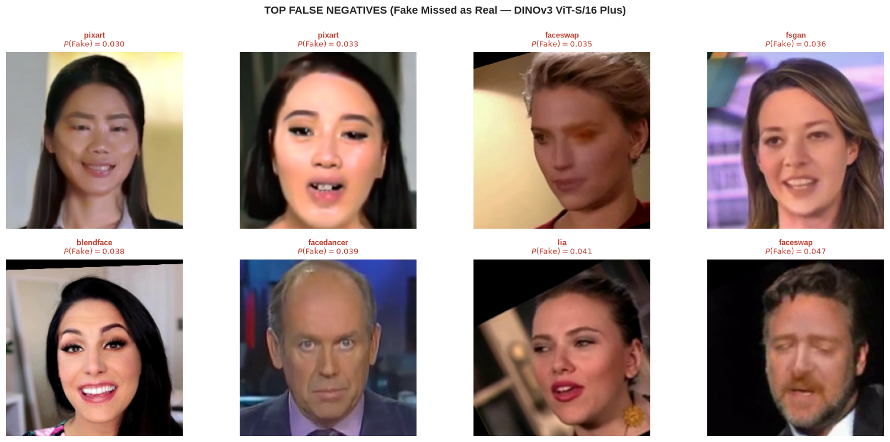
*Hình 4.10: Thư viện giám định Top 10 ca Bỏ sót Giả mạo (Fake $\rightarrow$ Real) (Trích xuất từ `coursework_deepfake_plus_v3_best.ipynb`).*

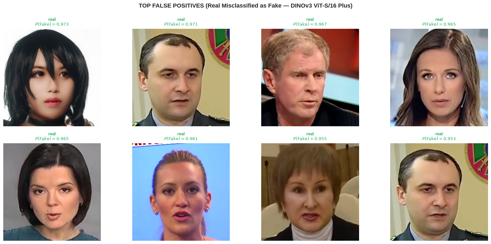
*Hình 4.11: Thư viện giám định Top 10 ca Báo động Giả (Real $\rightarrow$ Fake) và Hard True Positives (Trích xuất từ `coursework_deepfake_plus_v3_best.ipynb`).*

---

# PHẦN 5: KẾT LUẬN KHOA HỌC & KHUYẾN NGHỊ TRIỂN KHAI

### 🔬 Tóm tắt Khám phá Thực nghiệm Cốt lõi
1. **Vision Transformers (Meta DINOv3 ViT-Plus A1):** Là mô hình xuất sắc nhất trong việc **bắt trọn tối đa ảnh Deepfake** với độ nhạy (Recall) lên đến **$99.02\%$**, cắt giảm số ca bỏ sót giả mạo xuống mức kỷ lục (**FN = 105**), đặc biệt thống trị trên các mô hình khuếch tán Diffusion và Reenactment toàn mặt.
2. **Modern CNNs (Meta DINOv3 ConvNeXt-Tiny):** Là mô hình phòng thủ xuất sắc nhất về **độ tin cậy không báo động giả** với độ đặc hiệu (Specificity) đạt **$99.79\%$** (**FP = 22**), độ chính xác tổng thể **$99.22\%$**, tốc độ suy luận thời gian thực **153.2 FPS** trên GPU thương mại, vượt trội trong việc phát hiện vết cắt ghép đường biên FaceSwap.
3. **Mô hình Kết hợp (Joint Weighted Ensemble):** Khi kết hợp hai trường phái ($0.65 \cdot P_{\text{ViT}} + 0.35 \cdot P_{\text{CNN}}$), hệ thống tận dụng trọn vẹn cả hai dạng Inductive Bias (Cục bộ & Toàn cục), đẩy hiệu năng lên đỉnh cao **$99.30\%$ Accuracy** và **$99.98\%$ ROC-AUC** trên tập benchmark 44 phương pháp chuẩn.

### 🚀 Khuyến nghị Triển khai Thực tế
- **Hệ thống Quét Video Thời gian Thực (Real-time Video Stream):** Triển khai độc lập **Meta DINOv3 ConvNeXt-Tiny** để đạt tốc độ >150 FPS với tỷ lệ báo động giả tối thiểu ($0.21\%$).
- **Hệ thống Giám định Pháp y Kỹ thuật số (High-Security Digital Forensics):** Triển khai **Joint Weighted Ensemble** kết hợp trích xuất bản đồ nhiệt chú ý Attention Rollout và phân tích ELA để cung cấp bằng chứng giải thích được phục vụ công tác điều tra an ninh.

---
*Báo cáo được biên soạn và kiểm chứng tự động từ toàn bộ 23 Jupyter Notebooks và hạ tầng thực nghiệm của kho mã nguồn `deepfake-ViT`.*