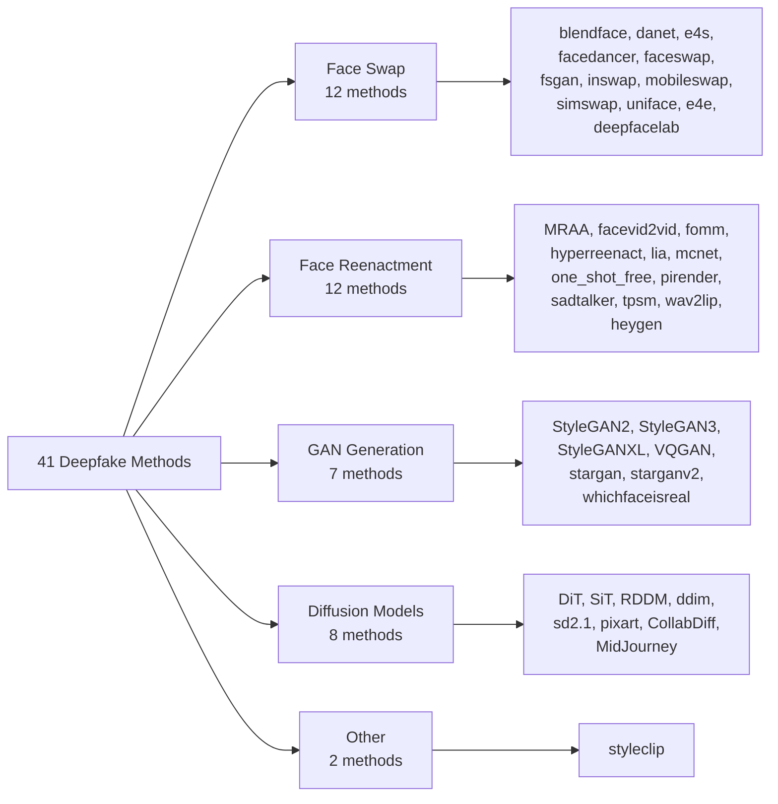
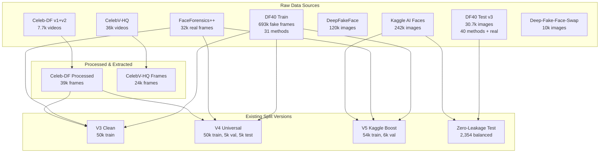

# 📊 EDA — Toàn Bộ Data Inventory & Train/Test Split Planning

> **Generated**: 2026-08-24  
> **Workspace**: `/workspace/data/`  
> **Project**: Anti-Face Deepfake Detection (DINOv3 ViT)

---

## 1. Tổng Quan Tất Cả Nguồn Data

| # | Source | Đường dẫn | Disk Size | Tổng Files | Real | Fake | Loại Data | Format |
|---|--------|-----------|-----------|------------|------|------|-----------|--------|
| 1 | **DF40 Train Extracted** | `/workspace/data/DF40_train_extracted/` | **74 GB** | **693,336** | 0 | 693,336 | Frames (31 methods) | `.png` |
| 2 | **DF40 Test v3** | `/workspace/data/test_data_v3/` | **4.4 GB** | **30,692** | 1,177 | 29,515 | Frames (40 methods + real) | `.png` |
| 3 | **DF40 Test Full** | `/workspace/data/df-40-test-full/` | **49 GB** | ~100k+ | — | — | Frames (38 methods) | `.png` |
| 4 | **Celeb-DF v1** | `/workspace/data/Celeb-DF/` | **2.1 GB** | **1,203** | 408 | 795 | Videos | `.mp4` |
| 5 | **Celeb-DF v2** | `/workspace/data/Celeb-DF-v2/` | **9.5 GB** | **6,530** | 890 | 5,639 | Videos | `.mp4` |
| 6 | **FaceForensics++** | `/workspace/data/FaceForensics++/` | **2.9 GB** | **31,949** | 31,949 | 0 | Frames (c23, 999 videos) | `.png` |
| 7 | **DeepFakeFace (DFF)** | `/workspace/data/deepFaceFake/` | **5.0 GB** | **120,000** | 30,000 | 90,000 | Images (4 generators) | `.jpg` |
| 8 | **Deep-Fake-Face-Swap** | `/workspace/data/deep-fake-face-swap/` | **187 MB** | **10,096** | ~5,048 | ~5,048 | Images (HF Parquet + crops) | `.jpg` |
| 9 | **Kaggle AI Faces** | `/workspace/data/kaggle/` | **7.7 GB** | **241,914** | ~70,000 | ~71,530 | Images (FFHQ + generators) | `.jpg` |
| 10 | **CelebV-HQ Videos** | `/workspace/data/celebvhq/` | **40 GB** | **35,666** | 35,666 | 0 | Raw Videos | `.mp4` |
| 11 | **CelebV-HQ Frames** | `/workspace/data/celebvhq_frames/` | **952 MB** | **24,000** | 24,000 | 0 | Extracted Frames | `.jpg` |
| 12 | **Processed Celeb-DF** | `/workspace/data/hoangtuan_data/processed/` | **~1.9 GB** | **39,042** | 25,854 | 13,188 | Extracted Frames | `.png` |
| | **TỔNG CỘNG** | | **~197 GB** | **~1,234,428+** | | | | |

---

## 2. Chi Tiết Từng Nguồn Data

### 2.1 DF40 Train Extracted (74 GB — 693,336 fake frames)

> [!IMPORTANT]
> Đây là nguồn training data lớn nhất. Chỉ chứa FAKE frames từ 31 phương pháp deepfake.

| Method | Files | Category |
|--------|-------|----------|
| **DiT** | 21,589 | Diffusion Transformer |
| **MRAA** | 45,622 | Motion Reenactment |
| **RDDM** | 21,589 | Residual Denoising Diffusion |
| **SiT** | 21,589 | Scalable Interpolant Transformer |
| **StyleGAN2** | 21,589 | GAN Generation |
| **StyleGAN3** | 21,589 | GAN Generation |
| **StyleGANXL** | 21,589 | GAN Generation |
| **VQGAN** | 21,589 | VQ-GAN Generation |
| **blendface** | 45,026 | Face Swap |
| **danet** | 45,292 | Dual Attention |
| **ddim** | 21,589 | DDIM Diffusion |
| **e4s** | 45,558 | Encoder4Editing Swap |
| **facedancer** | 45,494 | Face Swap |
| **faceswap** | 45,704 | Classical Face Swap |
| **facevid2vid** | 45,630 | Video Reenactment |
| **fomm** | 45,622 | First Order Motion |
| **fsgan** | 43,630 | FSGAN Swap/Reenact |
| **hyperreenact** | 37,566 | Neural Reenactment |
| **inswap** | 55,976 | InsightFace Swap |
| **lia** | 45,622 | Latent Image Animator |
| **mcnet** | 45,226 | Motion Conditioned |
| **mobileswap** | 45,648 | Mobile Face Swap |
| **one_shot_free** | 45,918 | One-Shot Free View |
| **pirender** | 45,828 | PI Renderer |
| **pixart** | 21,589 | PixArt Text2Image |
| **sadtalker** | 45,594 | Audio-Driven Talking Head |
| **sd2.1** | 21,589 | Stable Diffusion 2.1 |
| **simswap** | 62,700 | SimSwap |
| **tpsm** | 45,928 | Thin-Plate Spline |
| **uniface** | 11,794 | UniFace |
| **wav2lip** | 45,364 | Wav2Lip |
| **TOTAL** | **693,336** | **31 methods** |

### 2.2 DF40 Test v3 (4.4 GB — 30,692 images)

| Subdirectory | Label | Files | % of Total |
|-------------|-------|-------|------------|
| **real** | REAL | **1,177** | **3.84%** |
| CollabDiff | FAKE | 750 | 2.44% |
| DiT | FAKE | 1,004 | 3.27% |
| MRAA | FAKE | 690 | 2.25% |
| MidJourney | FAKE | 630 | 2.05% |
| RDDM | FAKE | 560 | 1.82% |
| SiT | FAKE | 1,004 | 3.27% |
| StyleGAN2 | FAKE | 616 | 2.01% |
| StyleGAN3 | FAKE | 1,004 | 3.27% |
| StyleGANXL | FAKE | 1,004 | 3.27% |
| VQGAN | FAKE | 603 | 1.96% |
| blendface | FAKE | 683 | 2.23% |
| danet | FAKE | 689 | 2.24% |
| ddim | FAKE | 606 | 1.97% |
| deepfacelab | FAKE | 25 | 0.08% |
| e4e | FAKE | 998 | 3.25% |
| e4s | FAKE | 370 | 1.21% |
| facedancer | FAKE | 689 | 2.24% |
| faceswap | FAKE | 680 | 2.22% |
| facevid2vid | FAKE | 680 | 2.22% |
| fomm | FAKE | 689 | 2.24% |
| fsgan | FAKE | 663 | 2.16% |
| heygen | FAKE | 24 | 0.08% |
| hyperreenact | FAKE | 684 | 2.23% |
| inswap | FAKE | 471 | 1.53% |
| lia | FAKE | 688 | 2.24% |
| mcnet | FAKE | 689 | 2.24% |
| mobileswap | FAKE | 1,398 | 4.56% |
| one_shot_free | FAKE | 688 | 2.24% |
| pirender | FAKE | 680 | 2.22% |
| pixart | FAKE | 933 | 3.04% |
| sadtalker | FAKE | 660 | 2.15% |
| sd2.1 | FAKE | 1,609 | 5.24% |
| simswap | FAKE | 684 | 2.23% |
| stargan | FAKE | 1,000 | 3.26% |
| starganv2 | FAKE | 999 | 3.26% |
| styleclip | FAKE | 1,000 | 3.26% |
| tpsm | FAKE | 689 | 2.24% |
| uniface | FAKE | 671 | 2.19% |
| wav2lip | FAKE | 560 | 1.82% |
| whichfaceisreal | FAKE | 750 | 2.44% |
| **TOTAL** | | **30,692** | **Real: 3.84% / Fake: 96.16%** |

### 2.3 Celeb-DF v1 & v2 (Videos)

| Dataset | Celeb-real | YouTube-real | Celeb-synthesis | Total | Disk |
|---------|-----------|-------------|----------------|-------|------|
| **Celeb-DF v1** | 158 videos | 250 videos | 795 videos | 1,203 | 2.1 GB |
| **Celeb-DF v2** | 590 videos | 300 videos | 5,639 videos | 6,530 | 9.5 GB |
| **Total** | **748 real** | **550 real** | **6,434 fake** | **7,733** | **11.6 GB** |

### 2.4 FaceForensics++ (2.9 GB — 31,949 real frames)

- Path: `original_sequences/youtube/c23/frames/`
- **999 video folders** with extracted frames
- All **REAL** — original YouTube face clips, c23 compression

### 2.5 DeepFakeFace — DFF Dataset (5.0 GB — 120,000 images)

| Subdirectory | Generator | Type | Files |
|-------------|-----------|------|-------|
| `wiki/` | IMDB-WIKI originals | **REAL** | **30,000** |
| `inpainting/` | Stable Diffusion Inpainting | FAKE | 30,000 |
| `insight/` | InsightFace toolbox | FAKE | 30,000 |
| `text2img/` | Stable Diffusion V1.5 | FAKE | 30,000 |
| **TOTAL** | | | **120,000** (25% real / 75% fake) |

### 2.6 Kaggle AI Faces (7.7 GB — 241,914 images)

#### Raw Sources (`data_source/`):
| Source | Type | Files |
|--------|------|-------|
| `ffhq/` | **REAL** | **70,000** |
| `fake/sfhq/` | SFHQ Synthetic | 20,000 |
| `fake/thispersondoesnotexist/` | StyleGAN2 | 20,499 |
| `fake/stable_diffusion/` | Stable Diffusion | 1,031 |
| `fake/faceswap/` | FaceSwap | ~14,428 |
| **Subtotal raw** | | **~125,959** |

#### Pre-split Dataset (`dataset/`):
| Split | Real (0/) | Fake (1/) | Total |
|-------|----------|----------|-------|
| **train** | 50,000 | 50,000 | 100,000 |
| **validate** | 10,000 | 10,000 | 20,000 |
| **test** | 10,000 | 10,000 | 20,000 |
| **Total** | **70,000** | **70,000** | **140,000** |

### 2.7 Deep-Fake-Face-Swap (187 MB — 10,096 images)

- HuggingFace dataset with Parquet + extracted image crops
- **train**: 8,076 | **test**: 1,010 | **validation**: 1,010
- Face-swap generated images (`hq_swap_*`, `swap_*_to_celeb`)

### 2.8 CelebV-HQ (40 GB — 35,666 videos + 24,000 frames)

- **celebvhq/**: 35,666 raw `.mp4` YouTube face clips (ALL REAL)
- **celebvhq_frames/**: 24,000 extracted face frame pairs (`.jpg`)
- **celebvhq_frames_probe/**: 600 probe frames

### 2.9 Processed Celeb-DF Frames

| Subdirectory | Files | Type |
|-------------|-------|------|
| `celeb_df_extracted/` | 25,854 | Real frames from Celeb-real & YouTube-real |
| `celeb_df_test_extracted/` | 2,590 | Test fake frames |
| `celeb_df_train_fake_extracted/` | 10,598 | Train fake frames |
| **TOTAL** | **39,042** | |

---

## 3. Tổng Hợp Real vs Fake Across All Sources

| Source | Real | Fake | Ratio (R:F) |
|--------|------|------|-------------|
| DF40 Train Extracted | 0 | 693,336 | 0:100 |
| DF40 Test v3 | 1,177 | 29,515 | 3.8:96.2 |
| FaceForensics++ (c23) | 31,949 | 0 | 100:0 (Real only) |
| Celeb-DF Processed | 25,854 | 13,188 | 66.2:33.8 |
| DeepFakeFace (DFF) | 30,000 | 90,000 | 25:75 |
| Kaggle (pre-split) | 70,000 | 70,000 | 50:50 |
| CelebV-HQ Frames | 24,000 | 0 | 100:0 (Real only) |
| Deep-Fake-Face-Swap | ~5,048 | ~5,048 | ~50:50 |
| **TỔNG CỘNG (images only)** | **~188,028** | **~901,087** | **~17.3:82.7** |

> [!WARNING]
> **Class Imbalance rất nghiêm trọng**: Toàn bộ workspace có ~17% real và ~83% fake.
> Cần cân bằng kỹ khi tạo split train/test chung.

---

## 4. Các Split Đã Tồn Tại

### 4.1 Split Chính ([hoangtuan_data/splits/](file:///workspace/data/hoangtuan_data/splits))

| Split File | Lines | Mô tả |
|-----------|-------|--------|
| `train.csv` / `train_pool_693k.csv` | 652,303 | Full DF40 train pool (all fake) |
| `train_balanced.csv` | 58,721 | 1:1 real:fake balanced |
| `train_domain_balanced.csv` | 50,001 | Domain-balanced (50k) |
| `train_domain_balanced_v2.csv` | 59,599 | Domain-balanced v2 |
| `val.csv` / `val_pool.csv` | 72,479 | Full validation pool |
| `val_balanced.csv` | 6,525 | Balanced validation |
| `val_domain_balanced.csv` | 5,001 | Domain-balanced val |
| `test.csv` / `test_full.csv` | 33,282 | Full test set (40 methods) |
| `test_balanced.csv` | 4,135 | Balanced test |

### 4.2 Experiment Splits ([deepfake-ViT/data/splits/](file:///workspace/hoangtuan/deepfake-ViT/data/splits))

| Split File | Lines | Mô tả |
|-----------|-------|--------|
| `train_v3_clean.csv` | 50,001 | Zero-leakage clean (EXP-03) |
| `train_v4_universal_balanced.csv` | 50,001 | 25k real + 25k fake, 38 methods (EXP-04) |
| `val_v4_universal_balanced.csv` | 5,001 | Universal balanced val |
| `test_v4_universal_balanced.csv` | 5,001 | Universal balanced test |
| `train_v5_combined_universal_kaggle_boost.csv` | 54,001 | V5 + Kaggle boost |
| `train_v5_weakfix.csv` | 121,885 | V5 weak-fix larger set |
| `train_v5_weakfix_v3.csv` | 129,885 | V5 weak-fix v3 |
| `test_balanced_fixed_zero_leakage.csv` | 2,355 | Golden zero-leakage test |

### 4.3 PhuongUyen Splits ([phuonguyen_data/splits/](file:///workspace/data/phuonguyen_data/splits))

| Split File | Lines | Mô tả |
|-----------|-------|--------|
| `raw_manifest.csv` | 120,955 | Full manifest |
| `train_clean.csv` | 84,668 | Cleaned train |
| `val_clean.csv` | 18,144 | Cleaned val |
| `test_clean.csv` | 18,145 | Cleaned test |

### 4.4 Zero-Leakage Benchmark ([zero_leakage_benchmark_fixed/](file:///workspace/data/zero_leakage_benchmark_fixed))

| Split File | Lines | Mô tả |
|-----------|-------|--------|
| `test_balanced_fixed_zero_leakage.csv` | 2,355 | 1,177 real : 1,177 fake, 0% leakage |
| `train_kaggle_midjourney_boost_12k.csv` | 12,063 | Kaggle + MidJourney boost |
| `train_v5_combined_universal_kaggle_boost.csv` | 54,001 | Combined universal + Kaggle |
| `val_v5_combined_universal_kaggle_boost.csv` | 6,001 | Combined val |

---

## 5. Phân Loại Deepfake Methods Theo Category

---

## 6. Planning: Chuẩn Bị Split Train/Test Chung

### 6.1 Vấn Đề Hiện Tại

> [!CAUTION]
> 1. **Real data thiếu** so với fake (17% vs 83%)
> 2. **DF40 Train chỉ có fake** — cần ghép thêm real từ FaceForensics++, Celeb-DF, Kaggle
> 3. **Nhiều split versions** đã tồn tại (v3, v4, v5) — cần thống nhất
> 4. **Data leakage** đã từng xảy ra → cần zero-leakage verification
> 5. **Identity overlap** giữa train/test cần kiểm soát

### 6.2 Đề Xuất Data Pool Cho Train/Test Chung

#### Real Sources (for balanced training):
| Source | Available Real | Recommended Use |
|--------|---------------|-----------------|
| FaceForensics++ c23 frames | 31,949 | ✅ Primary real source for training |
| Celeb-DF Processed (real) | 25,854 | ✅ Secondary real source |
| Kaggle FFHQ | 70,000 | ✅ Supplement for real diversity |
| CelebV-HQ Frames | 24,000 | ⚠️ Optional — different domain |
| DFF wiki (IMDB-WIKI) | 30,000 | ⚠️ Optional — different domain |

#### Fake Sources (for balanced training):
| Source | Available Fake | Methods Covered |
|--------|---------------|-----------------|
| DF40 Train Extracted | 693,336 | 31 methods |
| DF40 Test v3 (test only) | 29,515 | 40 methods |
| DFF (inpainting+insight+text2img) | 90,000 | 3 generators |
| Kaggle fake | 70,000 | SFHQ, StyleGAN2, SD, FaceSwap |

### 6.3 Recommended Final Split Strategy

| Split | Real | Fake | Total | Source Mix |
|-------|------|------|-------|------------|
| **Train** | 30,000 | 30,000 | 60,000 | FF++/Celeb/Kaggle + DF40 (31 methods) |
| **Val** | 3,000 | 3,000 | 6,000 | Same sources, identity-disjoint |
| **Test (golden)** | 1,177 | 1,177 | 2,354 | Zero-leakage benchmark (already verified) |
| **Test (full 40-method)** | 2,067 | 28,625 | 30,692 | DF40 test_data_v3 (40 methods benchmark) |

### 6.4 Next Steps

1. **Verify zero-leakage** cho mọi split mới bằng [`verify_zero_leakage.py`](file:///workspace/hoangtuan/deepfake-ViT/src/data/verify_zero_leakage.py)
2. **Identity-disjoint split** dùng [`split_dataset.py`](file:///workspace/hoangtuan/deepfake-ViT/src/data/split_dataset.py)
3. **Balance** real:fake 1:1 cho train và val
4. **Multi-domain coverage**: đảm bảo real đến từ ≥3 nguồn (FF++, Celeb-DF, Kaggle FFHQ)
5. **Method coverage**: đảm bảo fake đến từ ≥30 methods trong train
6. **Run EDA notebook** để visualize distributions trước khi finalize

---

## 7. Sơ Đồ Tổng Hợp Data Flow

