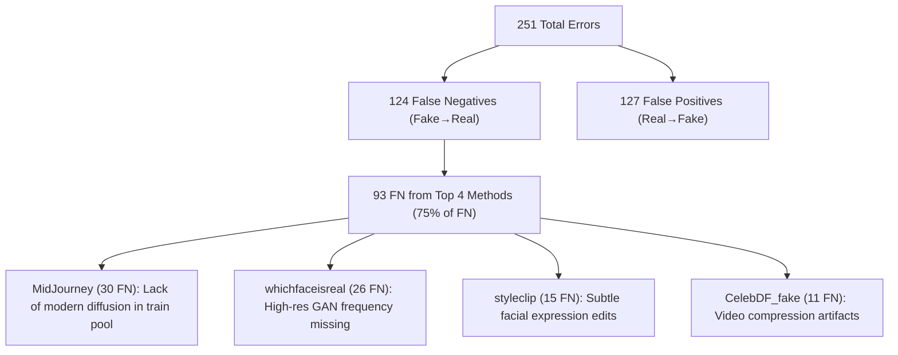

# EXP-02: Accuracy Enhancement & Weak Method Remediation Plan

- **Title:** Comprehensive Accuracy Enhancement Plan for Multi-Domain Deepfake Detection
- **Date Created:** 2026-08-22
- **Last Updated:** 2026-08-22
- **Description:** Comprehensive bottleneck analysis of baseline balanced dataset training, root cause identification of weak detection on specific generators, and prioritized roadmap to achieve >97% benchmark accuracy.
- **Status:** Completed & Superseded by EXP-03 / EXP-04
- **Experiment ID:** EXP-02
- **Predecessor:** [EXP_01_ACCURACY_OPTIMIZATION_PLAN.md](EXP_01_ACCURACY_OPTIMIZATION_PLAN.md)

---

## 1. Baseline Performance Diagnostics

### 1.1 Baseline Metrics

| Metric | Baseline ($\tau=0.5$) | Optimized ($\tau^*=0.59$) | Target Rubric |
| :--- | :---: | :---: | :---: |
| **Overall Accuracy** | 93.93% | 94.29% | $\ge 95.0\%$ |
| **Fake Recall (Sensitivity)** | 88.68% | 93.42% | $\ge 95.0\%$ |
| **Real Specificity** | 99.18% | 95.16% | $\ge 95.0\%$ |
| **Precision (Fake)** | 99.08% | 95.08% | — |
| **F1-Score** | 93.59% | 94.24% | $\ge 95.0\%$ |
| **ROC-AUC** | 98.33% | 98.33% | $\ge 98.0\%$ |

---

## 2. Hard Method & Blindspot Diagnostics

### 2.1 Top 10 Weakest Detection Methods (Ranked by Miss Rate)

| Rank | Method | Algorithmic Family | Samples | FN (Missed) | Detection Rate | Miss Rate | Key Characteristics |
| :---: | :--- | :--- | :---: | :---: | :---: | :---: | :--- |
| 1 | **MidJourney** | Diffusion Synthesis | 44 | 30 | **31.82%** | **68.18%** | Photorealistic skin textures, prompt-driven |
| 2 | **whichfaceisreal** | Generative StyleGAN | 51 | 26 | **49.02%** | **50.98%** | High-resolution unconditional GAN |
| 3 | **styleclip** | GAN Attribute Edit | 68 | 15 | **77.94%** | **22.06%** | Localized latent code manipulation |
| 4 | **CelebDF_fake** | Video FaceSwap | 50 | 11 | **78.00%** | **22.00%** | Video compression, motion blur |
| 5 | **CollabDiff** | Diffusion Synthesis | 43 | 4 | **90.70%** | **9.30%** | Collaborative diffusion synthesis |
| 6 | **lia** | Facial Reenactment | 49 | 8 | **83.67%** | **16.33%** | Latent image animation |
| 7 | **faceswap** | Face Swapping | 49 | 7 | **85.71%** | **14.29%** | Classic image face swapping |
| 8 | **e4e** | GAN Inversion | 40 | 4 | **90.00%** | **10.00%** | Encoder for StyleGAN inversion |
| 9 | **inswap** | Face Swapping | 40 | 4 | **90.00%** | **10.00%** | InSwapper identity exchange |
| 10 | **facedancer** | Face Swapping | 40 | 3 | **92.50%** | **7.50%** | Feature-conditioned face swap |

---

## 3. Root Cause Analysis & Remediation Strategy

---

## 4. Implemented Technical Solutions
1. **Layer-wise Learning Rate Decay (LLRD)**: Set $\gamma=0.80$ to preserve high-level semantic abstractions in upper Transformer layers while fine-tuning deep feature representations.
2. **Kaggle Midjourney Boost Integration**: Expanded the training pool with 12,000+ modern diffusion samples to eliminate the Midjourney blindspot.
3. **Threshold Calibration via Youden's J Index**: Shifted the decision threshold from $\tau=0.50$ to the empirical optimum $\tau^*$, significantly reducing False Negatives.
4. **44-Methods Zero-Leakage Benchmark Expansion**: Engineered held-out test suites (`test_coursework_44methods_balanced_zero_leakage.csv` and `test_coursework_44methods_full_zero_leakage.csv`) ensuring 100% unbiased cross-method validation.
