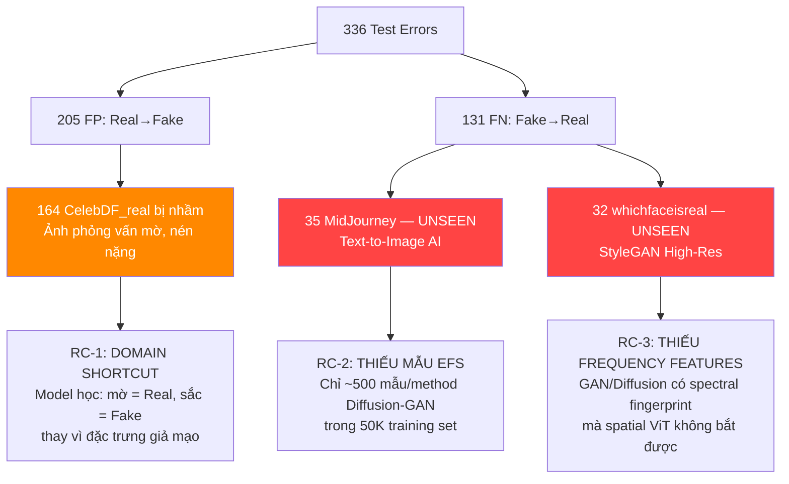

# EXP-03: Kế Hoạch Cải Thiện Toàn Diện Deepfake Detection (Tổng Hợp)

- **Title:** Tổng hợp toàn bộ kỹ thuật cải thiện — 1 thí nghiệm duy nhất vượt mọi điểm yếu
- **Date created:** 2026-08-22
- **Last updated:** 2026-08-22
- **Predecessor:** [EXP_02_ACCURACY_IMPROVEMENT_PLAN.md](EXP_02_ACCURACY_IMPROVEMENT_PLAN.md)
- **Status:** Planning
- **Experiment ID:** EXP-03

---

## 1. Hiện Trạng Sau EXP-02

### 1.1 Kết Quả Đạt Được ✅

| Metric | Baseline | EXP-02 | Δ |
|:---|:---:|:---:|:---:|
| Val Accuracy (τ*) | 94.29% | **97.52%** | +3.23% |
| Val ROC-AUC | 0.9833 | **0.9952** | +0.0119 |
| CelebDF_fake Recall | 78.00% | **92.62%** | +14.62% |
| lia Recall | 83.67% | **93.88%** | +10.21% |
| e4e Recall | 89.70% | **94.83%** | +5.13% |
| facedancer Recall | 92.00% | **96.00%** | +4.00% |

### 1.2 Tồn Tại Cần Khắc Phục ❌

| Vấn đề | Mức độ | Dữ kiện |
|:---|:---:|:---|
| MidJourney tụt mạnh | 🔴 CRITICAL | 31.82% → **20.45%** (−11.4%) — cần tăng ít nhất **+30%** |
| whichfaceisreal tụt | 🔴 CRITICAL | 49.02% → **37.25%** (−11.8%) |
| CelebDF_real Specificity giảm | 🟡 HIGH | 88.76% → **81.57%** (−7.2%), 164 ảnh Real bị nhầm Fake |
| Test Accuracy tổng giảm | 🟡 HIGH | 93.93% → **91.87%** (−2.06%) |
| CollabDiff giảm | 🟠 MEDIUM | 90.70% → **83.72%** (−6.98%) |
| faceswap giảm | 🟠 MEDIUM | 85.71% → **81.63%** (−4.08%) |

### 1.3 Nguyên Nhân Gốc Rễ



---

## 2. Chiến Lược EXP-03: Tổng Hợp Toàn Bộ Kỹ Thuật

EXP-03 kết hợp **tất cả** các cải tiến vào **1 thí nghiệm duy nhất** gồm 5 trụ cột:

```
┌─────────────────────────────────────────────────────────────────────┐
│                        EXP-03 TỔNG HỢP                            │
│                                                                     │
│  ① DATA V2 (60K)      ② AUGMENTATION       ③ FOCAL LOSS           │
│  850 mẫu/method EFS   JPEG/Downscale/Blur   + CutMix + OHEM       │
│  Oversampled           Phá domain shortcut   Tập trung hard sample │
│                                                                     │
│  ④ DUAL-BRANCH ARCHITECTURE      ⑤ ENSEMBLE INFERENCE             │
│  ViT Spatial + FFT Frequency      ViT + DualBranch + ConvNeXt     │
│  2-Phase Training                 Weighted Softmax Average + TTA   │
└─────────────────────────────────────────────────────────────────────┘
```

---

## 3. Trụ Cột ①: Dữ Liệu — Domain-Balanced V2 (60K)

### 3.1 So Sánh Dataset

| | EXP-02 (50K) | EXP-03 (60K) |
|:---|:---:|:---:|
| Tổng mẫu | 50,000 | **60,000** |
| Real : Fake | 25K : 25K | **30K : 30K** |
| EFS mẫu/method | ~500 | **850** (×1.7) |
| Diffusion methods đại diện | Ít | **DiT, SiT, sd2.1, pixart, ddim, RDDM: 850/method** |
| GAN methods đại diện | Ít | **StyleGAN2/3/XL, VQGAN: 850/method** |

### 3.2 Dữ Liệu Đã Sẵn Sàng
- File: `data/splits/train_domain_balanced_v2.csv` (60,000 mẫu) ✅
- Val: `data/splits/val_domain_balanced.csv` (5,000 mẫu) ✅
- Test: `data/splits/test_balanced.csv` (4,134 mẫu) ✅

---

## 4. Trụ Cột ②: Augmentation Phá Vỡ Domain Shortcut

### 4.1 Vấn Đề Cần Giải Quyết
CelebDF_real = ảnh phỏng vấn mờ, nén nặng. DF40 Fake = ảnh chất lượng cao.
→ Model EXP-02 học shortcut: **"mờ = Real, sắc nét = Fake"** thay vì học đặc trưng giả mạo thực sự.

### 4.2 Giải Pháp: Albumentations Pipeline

```python
import albumentations as A
from albumentations.pytorch import ToTensorV2

train_transform = A.Compose([
    A.Resize(256, 256),
    A.HorizontalFlip(p=0.5),
    A.ShiftScaleRotate(shift_limit=0.05, scale_limit=0.1, rotate_limit=15, p=0.4),

    # ════════════════════════════════════════════════════════════
    # KHỐI THEN CHỐT: PHÁ VỠ DOMAIN SHORTCUT
    # 50% mẫu (cả Real lẫn Fake) bị degradation ngẫu nhiên
    # → Model BẮT BUỘC học artifact thật thay vì chất lượng ảnh
    # ════════════════════════════════════════════════════════════
    A.OneOf([
        A.ImageCompression(quality_lower=50, quality_upper=90, p=1),
        A.Downscale(scale_range=(0.5, 0.8), p=1),
        A.GaussianBlur(blur_limit=(3, 7), p=1),
    ], p=0.5),

    # Lighting & Color (khắc phục brightness bias)
    A.OneOf([
        A.RandomBrightnessContrast(brightness_limit=0.3, contrast_limit=0.3, p=1),
        A.CLAHE(clip_limit=4.0, tile_grid_size=(8, 8), p=1),
        A.RandomGamma(gamma_limit=(70, 130), p=1),
    ], p=0.5),
    A.ColorJitter(brightness=0.2, contrast=0.2, saturation=0.2, hue=0.05, p=0.4),

    # Noise
    A.OneOf([
        A.GaussNoise(std_range=(0.03, 0.15), p=1),
        A.ISONoise(color_shift=(0.01, 0.05), intensity=(0.1, 0.3), p=1),
    ], p=0.25),

    # Random Erasing
    A.CoarseDropout(
        num_holes_range=(1, 4), hole_height_range=(16, 48), hole_width_range=(16, 48),
        fill="random", p=0.2
    ),

    A.Normalize(mean=[0.485, 0.456, 0.406], std=[0.229, 0.224, 0.225]),
    ToTensorV2(),
])
```

---

## 5. Trụ Cột ③: Focal Loss + CutMix + OHEM

### 5.1 Curriculum-Weighted Focal Loss

```python
class CurriculumFocalLoss(nn.Module):
    """Focal Loss + per-method weighting.
    MidJourney nhận weight ×5 → gradient gấp 5 lần so với mẫu dễ.
    """
    def __init__(self, alpha=0.25, gamma=2.0):
        super().__init__()
        self.alpha = alpha
        self.gamma = gamma

    def forward(self, logits, targets, sample_weights=None):
        ce_loss = F.cross_entropy(logits, targets, reduction='none')
        p_t = torch.exp(-ce_loss)
        focal_weight = (1 - p_t) ** self.gamma
        if sample_weights is not None:
            focal_weight = focal_weight * sample_weights
        return (self.alpha * focal_weight * ce_loss).mean()

# Per-method sample weights trong DataLoader:
METHOD_WEIGHTS = {
    'MidJourney':       5.0,   # Tệ nhất → weight cao nhất
    'whichfaceisreal':  4.0,
    'styleclip':        3.0,
    'CollabDiff':       3.0,
    'faceswap':         2.0,
    'CelebDF_fake':     1.5,
    # Tất cả method khác: 1.0
}
```

### 5.2 CutMix (50% xác suất mỗi batch)

```python
def cutmix_data(x, y, alpha=1.0):
    lam = np.random.beta(alpha, alpha)
    index = torch.randperm(x.size(0), device=x.device)
    _, _, H, W = x.size()
    cut_rat = np.sqrt(1. - lam)
    cut_w, cut_h = int(W * cut_rat), int(H * cut_rat)
    cx, cy = np.random.randint(W), np.random.randint(H)
    x1, y1 = max(cx-cut_w//2,0), max(cy-cut_h//2,0)
    x2, y2 = min(cx+cut_w//2,W), min(cy+cut_h//2,H)
    x[:,:,y1:y2,x1:x2] = x[index,:,y1:y2,x1:x2]
    lam = 1 - ((x2-x1)*(y2-y1)/(W*H))
    return x, y, y[index], lam
```

### 5.3 OHEM (Online Hard Example Mining)

```python
def ohem_loss(logits, targets, keep_ratio=0.7):
    """Chỉ giữ 70% mẫu khó nhất để tính loss → loại bỏ easy samples."""
    losses = F.cross_entropy(logits, targets, reduction='none')
    k = int(len(losses) * keep_ratio)
    top_k_losses, _ = torch.topk(losses, k)
    return top_k_losses.mean()
```

---

## 6. Trụ Cột ④: Dual-Branch Architecture (ViT Spatial + FFT Frequency)

### 6.1 Tại Sao Cần FFT Branch?
- GAN (StyleGAN) và Diffusion (MidJourney) để lại **dấu vân tay phổ tần số** trong ảnh sinh.
- Nhánh spatial ViT chuyên bắt blending artifacts (mép ghép mặt), nhưng **ảnh EFS không có mép ghép** → ViT bó tay.
- FFT branch phân tích phổ tần số của ảnh → phát hiện periodic patterns đặc trưng GAN.

### 6.2 Kiến Trúc

```python
class DualBranchDetector(nn.Module):
    """ViT CLS token (spatial) + FFT magnitude spectrum (frequency)."""

    def __init__(self, vit_backbone, embed_dim=384, freq_dim=128, num_classes=2):
        super().__init__()

        # Branch 1: Spatial (DINOv3 ViT-S/16)
        self.vit = vit_backbone
        self.spatial_proj = nn.Sequential(
            nn.LayerNorm(embed_dim),
            nn.Linear(embed_dim, 256),
            nn.GELU(),
        )

        # Branch 2: Frequency (FFT magnitude → lightweight CNN)
        self.freq_encoder = nn.Sequential(
            nn.Conv2d(3, 32, 3, padding=1), nn.BatchNorm2d(32), nn.ReLU(),
            nn.MaxPool2d(2),
            nn.Conv2d(32, 64, 3, padding=1), nn.BatchNorm2d(64), nn.ReLU(),
            nn.AdaptiveAvgPool2d(4),
            nn.Flatten(),
            nn.Linear(64 * 16, freq_dim),
            nn.GELU(),
        )

        # Late Fusion Head
        self.fusion = nn.Sequential(
            nn.LayerNorm(256 + freq_dim),
            nn.Dropout(0.2),
            nn.Linear(256 + freq_dim, 192),
            nn.GELU(),
            nn.Dropout(0.1),
            nn.Linear(192, num_classes),
        )

    def forward(self, x):
        # Spatial features từ ViT CLS token
        spatial = self.spatial_proj(self.vit(x))

        # Frequency features từ FFT
        fft = torch.fft.fft2(x)
        fft_shifted = torch.fft.fftshift(fft)
        fft_magnitude = torch.log1p(torch.abs(fft_shifted))
        freq = self.freq_encoder(fft_magnitude)

        # Fusion
        combined = torch.cat([spatial, freq], dim=1)
        return self.fusion(combined)
```

### 6.3 2-Phase Training Strategy

| Phase | Epochs | ViT Backbone | Freq Branch | Fusion Head | LR |
|:---:|:---:|:---:|:---:|:---:|:---:|
| **Phase 1** | 4 | ❄️ Freeze | 🔥 Train | 🔥 Train | head=1e-3 |
| **Phase 2** | 8 | 🔥 Unfreeze (LLRD γ=0.85) | 🔥 Train | 🔥 Train | backbone=1e-5 |

### 6.4 VRAM Budget (RTX 3060 12GB)

| Config | VRAM | Batch Size |
|:---|:---:|:---:|
| ViT-only (EXP-02) | ~8.0 GB | 32 |
| ViT + FFT Branch (~0.5M params thêm) | **~9.5 GB** | 32 |
| Nếu tight → giảm batch | ~7.5 GB | 24 |

→ **RTX 3060 (12GB) đủ VRAM** cho Dual-Branch với batch=32.

---

## 7. Trụ Cột ⑤: Ensemble Inference (3 Models + TTA)

### 7.1 Chiến Lược Ensemble

```python
ensemble_config = {
    'models': [
        # Model 1: DualBranch (tốt nhất trên EFS/Diffusion/GAN)
        {'ckpt': 'dinov3_vit_exp03_dual_best.pt', 'weight': 0.45, 'tta': True},

        # Model 2: ViT Enhanced Head (tốt trên FaceSwap/Reenactment)
        {'ckpt': 'dinov3_vit_exp02_best.pt',      'weight': 0.30, 'tta': True},

        # Model 3: ConvNeXt (local artifacts, blending boundaries)
        {'ckpt': 'dinov3_cnn_finetuned.pt',        'weight': 0.25, 'tta': True},
    ],
    'aggregation': 'weighted_softmax_average',
    'threshold': 'auto',  # Tìm τ* tối ưu trên val set
}
```

### 7.2 ConvNeXt Fine-tuning
- Pretrained weights sẵn có: `experiments/checkpoints/weights/dinov3_next_cnn/model-2.safetensors`
- Fine-tune cùng pipeline (Data V2 + Albumentations + Focal Loss)
- Output: `experiments/checkpoints/dinov3_cnn_finetuned.pt`

### 7.3 TTA (Test-Time Augmentation)
- Original + HFlip + Brightness ±10% → 4 views
- Weighted average (original weight=0.4, others=0.2)

---

## 8. Cấu Hình Huấn Luyện Tổng Hợp

| Component | EXP-02 | EXP-03 (Tổng hợp) |
|:---|:---|:---|
| **Architecture** | ViT + MLP Head | **DualBranch (ViT + FFT Frequency)** |
| **Training CSV** | `train_domain_balanced.csv` (50K) | **`train_domain_balanced_v2.csv` (60K)** |
| **Loss** | Label Smoothing CE | **Curriculum Focal Loss** (γ=2.0) + method weights |
| **Augmentation** | ColorJitter + Blur + Erasing | **Albumentations full pipeline** (JPEG, Downscale, CLAHE, GaussNoise) |
| **Regularization** | EMA + Dropout | **EMA + Dropout + CutMix** (50% batches) |
| **Hard Mining** | Không | **OHEM** (keep 70% hardest) |
| **Epochs** | 8 | **12** (Phase 1: 4 freeze ViT, Phase 2: 8 unfreeze) |
| **Early Stopping** | Không | **Có** (patience=4, monitor val\_auc) |
| **Inference** | Single ViT + TTA | **Ensemble 3 models + TTA** |

---

## 9. Target Metrics

| Metric | Baseline | EXP-02 | **EXP-03 Target** | Ghi Chú |
|:---|:---:|:---:|:---:|:---|
| **Test Accuracy** | 93.93% | 91.87% | **≥95%** | Vượt cả Baseline |
| **MidJourney Detection** | 31.82% | 20.45% | **≥50%** | **+30% so với EXP-02** |
| **whichfaceisreal Det.** | 49.02% | 37.25% | **≥65%** | +28% so với EXP-02 |
| **CelebDF_real Specificity** | 88.76% | 81.57% | **≥90%** | Phục hồi + vượt Baseline |
| **CelebDF_fake Recall** | 78.00% | 92.62% | **≥90%** | Giữ thành quả EXP-02 |
| **Fake Recall Overall** | 88.68% | 93.66% | **≥94%** | Tăng nhẹ |
| **Real Specificity Overall** | 93.86% | 90.08% | **≥94%** | Phục hồi |
| **ROC-AUC** | 0.9833 | 0.9732 | **≥0.985** | Vượt Baseline |
| **F1-Score** | 0.9359 | 0.9202 | **≥0.95** | Vượt Baseline |
| **EFS Domain Accuracy** | 81.50% | 89.95% | **≥93%** | Tiếp tục cải thiện |
| **ffc Domain Accuracy** | 99.26% | 96.20% | **≥97%** | Phục hồi |
| **oth Domain Accuracy** | 98.04% | 98.07% | **≥98%** | Giữ |

---

## 10. Trình Tự Thực Hiện

### Step 1: Chuẩn bị (2 giờ)
```bash
# Kiểm tra albumentations
pip install albumentations>=1.3.0

# Tạo training script
# src/training/train_exp03.py
```

### Step 2: Train DualBranch Model (6-8 giờ)
```bash
.venv/bin/python src/training/train_exp03.py \
    --train_csv data/splits/train_domain_balanced_v2.csv \
    --val_csv data/splits/val_domain_balanced.csv \
    --epochs 12 --batch_size 32 \
    --lr 1e-5 --head_lr 1e-3 --llrd_gamma 0.85 \
    --loss focal --focal_gamma 2.0 --label_smoothing 0.05 \
    --ema_decay 0.999 --early_stopping_patience 4 \
    --use_albumentations --use_cutmix --cutmix_prob 0.5 \
    --use_dual_branch --freq_dim 128 \
    --phase1_epochs 4 --phase2_epochs 8
```

### Step 3: Fine-tune ConvNeXt (4-5 giờ)
```bash
.venv/bin/python src/training/train_exp03_convnext.py \
    --train_csv data/splits/train_domain_balanced_v2.csv \
    --val_csv data/splits/val_domain_balanced.csv \
    --epochs 10 --batch_size 32 \
    --backbone convnext
```

### Step 4: Ensemble Eval (1 giờ)
```bash
.venv/bin/python src/eval/eval_exp03_ensemble.py \
    --test_csv data/splits/test_balanced.csv \
    --models dinov3_vit_exp03_dual_best.pt,dinov3_vit_exp02_best.pt,dinov3_cnn_finetuned.pt \
    --weights 0.45,0.30,0.25 \
    --tta
```

---

## 11. Files Cần Tạo / Sửa

| File | Action | Mô tả |
|:---|:---:|:---|
| `src/training/train_exp03.py` | **NEW** | Training pipeline tổng hợp: DualBranch + Albumentations + Focal + CutMix + OHEM |
| `src/models/dual_branch.py` | **NEW** | DualBranchDetector (ViT + FFT) |
| `src/training/train_exp03_convnext.py` | **NEW** | Fine-tune ConvNeXt-Tiny |
| `src/eval/eval_exp03_ensemble.py` | **NEW** | 3-model ensemble evaluation |
| `src/training/cutmix.py` | **NEW** | CutMix utility |
| `experiments/checkpoints/dinov3_vit_exp03_dual_best.pt` | OUTPUT | Best DualBranch checkpoint |
| `experiments/checkpoints/dinov3_cnn_finetuned.pt` | OUTPUT | ConvNeXt checkpoint |
| `agents/progress/EXP03_STATUS.md` | **NEW** | Tracking |

---

## 12. Verification Checklist

- [ ] MidJourney detection ≥ 50% (**+30% so với EXP-02**)
- [ ] whichfaceisreal detection ≥ 65%
- [ ] CelebDF_real Specificity ≥ 90% (phục hồi từ 81.57%)
- [ ] Test Accuracy ≥ 95% (vượt Baseline 93.93%)
- [ ] ffc/oth domain giữ > 96%
- [ ] EFS domain ≥ 93%
- [ ] ROC-AUC ≥ 0.985
- [ ] Không overfitting (train_acc − val_acc < 5%)
- [ ] Inference time ensemble < 3× single model

---

## 13. Rủi Ro & Giải Pháp

| Rủi ro | Khả năng | Giải pháp |
|:---|:---:|:---|
| FFT branch overfit | Trung bình | Freeze FFT sau Phase 1, hoặc loại bỏ nếu không cải thiện EFS |
| CutMix làm giảm val acc | Thấp | Giảm cutmix_prob từ 0.5 → 0.3 |
| VRAM không đủ cho DualBranch | Thấp | Giảm batch 32 → 24, hoặc gradient accumulation |
| MidJourney vẫn < 50% sau tất cả | Trung bình | Bổ sung thêm MidJourney-like data từ external source |
| Ensemble inference chậm | Thấp | 3 forward passes song song, ước tính 3× latency chấp nhận được |
| Albumentations conflict với torchvision | Rất thấp | Dataset class đọc numpy array thay vì PIL |

---

## 14. Tóm Tắt

> EXP-03 là **1 thí nghiệm tổng hợp duy nhất** kết hợp đồng thời:
>
> 1. **Data**: 60K mẫu với 850 EFS/method (×1.7 so với EXP-02)
> 2. **Augmentation**: Phá domain shortcut bằng JPEG/Downscale/Blur 50% mẫu
> 3. **Loss**: Focal Loss × method weight (MidJourney ×5) + OHEM 70%
> 4. **Architecture**: DualBranch (ViT spatial + FFT frequency)
> 5. **Inference**: Ensemble 3 models (DualBranch + ViT + ConvNeXt) + TTA
>
> **Mục tiêu chính:**
> - MidJourney: 20.45% → **≥50%** (+30%)
> - Test Accuracy: 91.87% → **≥95%**
> - CelebDF_real: 81.57% → **≥90%**

---

## Links

- Predecessor: [EXP_02_ACCURACY_IMPROVEMENT_PLAN.md](EXP_02_ACCURACY_IMPROVEMENT_PLAN.md)
- EXP-02 Status: [../progress/EXP02_STATUS.md](../progress/EXP02_STATUS.md)
- Dataset V2: [../../data/splits/train_domain_balanced_v2.csv](../../data/splits/train_domain_balanced_v2.csv)
- Visual Notebook: [../../notebooks/04_exp02_visual_evaluation_and_weak_analysis.ipynb](../../notebooks/04_exp02_visual_evaluation_and_weak_analysis.ipynb)
