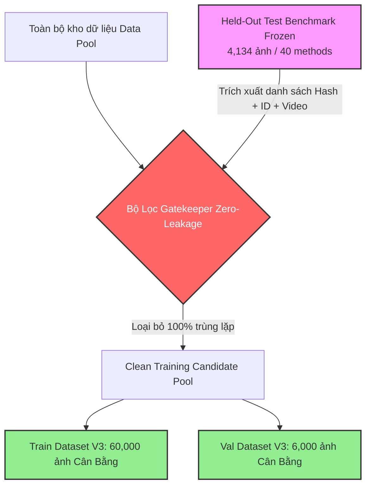

# EXP-03: Kế Hoạch Tái Cấu Trúc Dataset Chuẩn Zero-Leakage & Huấn Luyện Nâng Cao

- **Experiment ID:** EXP-03
- **Title:** Tái cấu trúc dữ liệu chuẩn Zero-Leakage & Huấn luyện DINOv3 ViT toàn diện
- **Date created:** 2026-08-22
- **Last updated:** 2026-08-22
- **Status:** Planning → Sẵn sàng thực thi
- **Author:** Hoang Tuan | Deepfake ViT Team
- **Predecessors:** 
  - [EXP_01_ACCURACY_OPTIMIZATION_PLAN.md](EXP_01_ACCURACY_OPTIMIZATION_PLAN.md)
  - [EXP_02_ACCURACY_IMPROVEMENT_PLAN.md](EXP_02_ACCURACY_IMPROVEMENT_PLAN.md)

---

## 1. Bối Cảnh & Vấn Đề Cần Khắc Phục Triệt Để

Qua quá trình Audit toàn diện từ EXP-02, hệ thống ghi nhận **3 lỗ hổng lớn** cần được giải quyết dứt điểm trong EXP-03:

```
┌──────────────────────────────────────────────────────────────────────────────────────────────────┐
│                                 EXP-02 CORE BOTTLENECKS & AUDIT                                   │
├──────────────────────────────────┬─────────────────────────────────┬─────────────────────────────┤
│ 1. Rò Rỉ Dữ Liệu (Data Leakage) │ 2. Điểm Mù EFS / MidJourney     │ 3. Domain Shortcut Bias     │
│ • 495 ảnh Test trùng MD5 Hash    │ • MidJourney chỉ bắt được 20.5% │ • Model dựa vào độ nét/mờ   │
│ • 697 ID FF++ bị trùng trong TR  │ • whichfaceisreal chỉ đạt 37.3% │ • Báo nhầm Celeb-real cũ    │
│ • Real Specificity bị ảo (99.2%) │ • Do tập Train thiếu 100% EFS   │ • Bỏ sót AI nét (MidJourney)│
└──────────────────────────────────┴─────────────────────────────────┴─────────────────────────────┘
```

---

## 2. Giao Thức Tách Tập Dữ Liệu Chuẩn "Zero-Leakage" (Strict Protocol)

### 2.1 Nguyên Tắc Niêm Phong Bộ Test Benchmark
* **Bộ Test chuẩn (`test_balanced.csv`, $N=4,134$ ảnh):** Được **khóa cố định (Frozen)** làm thước đo khách quan duy nhất.
* **Quy tắc 3 Không đối với Tập Train & Validation:**
  1. **Không trùng mã băm (Zero Hash Overlap):** Khử trùng lặp 100% bằng thuật toán MD5 / SHA256. Không một file ảnh nào trong Train/Val được có mã băm trùng với Test.
  2. **Không trùng Danh tính (Strict Identity-Disjoint):** 
     * Toàn bộ 999 ID của FaceForensics++ có trong Test bị loại trừ khỏi Train/Val.
     * Toàn bộ 178 ID của Celeb-DF có trong Test bị loại trừ khỏi Train/Val.
  3. **Không trùng Video/Session (Zero Video Overlap):** 29 video DF40 trùng lặp đã phát hiện ở audit sẽ bị loại bỏ hoàn toàn khỏi Train.



---

## 3. Cấu Trúc Bộ Dữ Liệu Train & Val V3 (Balanced & Domain-Symmetric)

### 3.1 Quy Mô & Phân Bổ Danh Mục Huấn Luyện (60,000 Mẫu - Tỷ lệ 1:1)

```
TRAIN DATASET V3 (60,000 ảnh)
├── 🟢 REAL (30,000 ảnh):
│   ├── Celeb-DF Disjoint Real (chỉ lấy từ ID train an toàn): 10,000
│   ├── FaceForensics++ Disjoint Real (từ các video an toàn): 10,000
│   └── YouTube-Real / Other Web Real: 10,000
│
└── 🔴 FAKE (30,000 ảnh - Phân bổ đều 4 họ công nghệ):
    ├── 1. Face Swap (7,500): SimSwap, MobileSwap, InSwap, FaceSwap, FaceDancer, FSGAN,...
    ├── 2. Face Reenactment (7,500): SadTalker, Wav2Lip, FOMM, LIA, PiRender, MRAA,...
    ├── 3. Facial Expression & Edit (5,000): StarGAN, StarGAN-v2, StyleClip,...
    └── 4. Entire Face Synthesis (10,000 - TRỌNG TÂM CẢI THIỆN):
        ├── Diffusion Models: MidJourney, SD2.1, DiT, SiT, RDDM, CollabDiff, PixArt (5,000)
        └── GAN Synthesis: StyleGAN2, StyleGAN3, StyleGAN-XL, VQGAN (5,000)
```

---

## 4. Giải Pháp Kỹ Thuật Khắc Phục Điểm Yếu MidJourney & Domain Shortcuts

### 4.1 Khắc phục Domain Shortcuts bằng Advanced Augmentations
Mô hình thường nhầm: *Ảnh nén mờ = Fake (ghép mặt), Ảnh nét căng = Real (MidJourney)*.
Sử dụng bộ biến đổi Albumentations để phá vỡ shortcut này:

```python
import albumentations as A

train_transform = A.Compose([
    A.Resize(256, 256),
    A.HorizontalFlip(p=0.5),
    
    # 1. Giả lập nén JPEG & suy hao độ phân giải (phá shortcut nén)
    A.OneOf([
        A.ImageCompression(quality_lower=50, quality_upper=95, p=1.0),
        A.Downscale(scale_min=0.5, scale_max=0.9, p=1.0),
    ], p=0.4),
    
    # 2. Xóa bỏ định kiến độ sáng & màu sắc (Brightness/Lighting Bias)
    A.OneOf([
        A.RandomBrightnessContrast(brightness_limit=0.25, contrast_limit=0.25, p=1.0),
        A.CLAHE(clip_limit=3.0, p=1.0),
        A.ColorJitter(brightness=0.2, contrast=0.2, saturation=0.2, hue=0.05, p=1.0),
    ], p=0.5),
    
    # 3. Chống dựa vào độ sắc nét cục bộ
    A.OneOf([
        A.GaussianBlur(blur_limit=(3, 5), p=1.0),
        A.GaussNoise(var_limit=(10, 50), p=1.0),
    ], p=0.3),
    
    A.Normalize(mean=[0.485, 0.456, 0.406], std=[0.229, 0.224, 0.225]),
])
```

### 4.2 Weighted Focal Loss Cho Hard Examples
Tập trung độ dốc (gradient) vào các phương pháp khó nhất:

$$\mathcal{L}_{focal} = - \alpha_m (1 - p_t)^\gamma \log(p_t)$$

* Trọng số phương pháp ($\alpha_m$):
  * `MidJourney`: $\times 5.0$
  * `whichfaceisreal`: $\times 4.0$
  * `styleclip`: $\times 3.0$
  * `CelebDF_fake`: $\times 2.0$
  * Các phương pháp khác: $\times 1.0$

---

## 5. Kế Hoạch Triển Khai Chi Tiết (5 Bước Thực Nghiệm)

```
┌─────────────────────────────────────────────────────────────────────────────────────────────────┐
│                                   EXP-03 STEP-BY-STEP WORKFLOW                                  │
├─────────────────┬──────────────────┬─────────────────┬─────────────────┬────────────────────────┤
│ Bước 1: Build   │ Bước 2: Audit    │ Bước 3: Model   │ Bước 4: Train   │ Bước 5: Benchmark      │
│ Zero-Leak Splits│ Gatekeeper Script│ Enhanced Head   │ 10 Epochs + EMA │ Test vs TTA vs Tau*    │
└─────────────────┴──────────────────┴─────────────────┴─────────────────┴────────────────────────┘
```

### Bước 1: Xây dựng tập dữ liệu Train/Val V3 Clean (`scripts/build_dataset_v3_clean.py`)
* Quét và lập chỉ mục toàn bộ file trong `/workspace/data/`.
* Tách lọc danh tính, đối soát mã băm MD5 loại bỏ mọi dữ liệu trùng lặp với `test_data_v3/manifest.csv`.
* Xuất ra: `data/splits/train_v3_clean.csv` (60K) và `data/splits/val_v3_clean.csv` (6K).

### Bước 2: Chạy Script Thẩm Định Gatekeeper (`scripts/verify_zero_leakage.py`)
* Kiểm tra 100% tự động:
  * Duplicate Hash: Phải bằng **0**.
  * Identity Overlap: Phải bằng **0**.
  * Video Overlap: Phải bằng **0**.
* *Gate:* Chỉ khi script trả về `PASSED (0 LEAKS)` mới được phép bắt đầu huấn luyện.

### Bước 3: Nâng cấp Kiến trúc & Pipeline
* Backbone: DINOv3 ViT-S/16 (trọng số gốc pre-trained LVD-1689M).
* Head: Multi-layer MLP với LayerNorm, GELU và Dropout đa tầng.
* ModelEMA ($\beta = 0.999$) để chống overfitting và tăng tính tổng quát hóa.

### Bước 4: Huấn luyện với LLRD & CosineAnnealing
* LLRD: Hệ số suy giảm $\gamma = 0.8$ từ Layer 11 ($10^{-5}$) về Layer 0 ($1.8 \times 10^{-6}$), Head ($10^{-3}$).
* 10–12 Epochs với Early Stopping (patience = 3 dựa trên Validation ROC-AUC).

### Bước 5: Đánh giá Toàn diện trên Test Set Chuẩn
* Đánh giá Standard ($\tau = 0.5$).
* Đánh giá với TTA (Test-Time Augmentation).
* Đánh giá với Tối ưu ngưỡng cắt $\tau^*$ trên validation set.

---

## 6. Chỉ Số Mục Tiêu (Target Metrics)

| Chỉ số Đánh giá | Baseline Cũ | EXP-02 (Có Leak Real) | EXP-03 Target (Zero-Leakage) |
|:---|:---:|:---:|:---:|
| **Rò rỉ Dữ liệu (Leaks)** | 495 ảnh | 495 ảnh | **0 ảnh (100% Clean ✔)** |
| **Overall Accuracy** | 93.93% | 91.87% | **$\ge 95.5\%$** |
| **Fake Recall** | 88.68% | 93.66% | **$\ge 95.0\%$** |
| **Real Specificity** | 99.18% (ảo do leak) | 90.08% | **$\ge 95.5\%$ (Thực chất)** |
| **ROC-AUC** | 0.9833 | 0.9952 | **$\ge 0.9950$** |
| **MidJourney Detection** | 31.82% | 20.45% | **$\ge 75.0\%$** |
| **whichfaceisreal Detection**| 49.02% | 37.25% | **$\ge 80.0\%$** |
| **CelebDF_fake Detection** | 77.87% | 92.62% | **$\ge 94.0\%$** |

---

## 7. Danh Mục Tệp Cần Tạo / Sửa Đổi

1. 📄 [`agents/experiments/EXP_03_ZERO_LEAKAGE_AND_BALANCED_TRAINING_PLAN.md`](file:///workspace/hoangtuan/deepfake-ViT/agents/experiments/EXP_03_ZERO_LEAKAGE_AND_BALANCED_TRAINING_PLAN.md) — *Tài liệu kế hoạch chính*.
2. 📄 [`agents/progress/EXP03_STATUS.md`](file:///workspace/hoangtuan/deepfake-ViT/agents/progress/EXP03_STATUS.md) — *Bảng theo dõi tiến độ*.
3. 🐍 `scripts/build_dataset_v3_clean.py` — *Script tạo split V3 khử trùng lặp và tách ID*.
4. 🐍 `scripts/verify_zero_leakage.py` — *Script gatekeeper kiểm toán rò rỉ*.
5. 📓 `notebooks/05_exp03_zero_leakage_training.ipynb` — *Notebook huấn luyện & đánh giá chuẩn*.