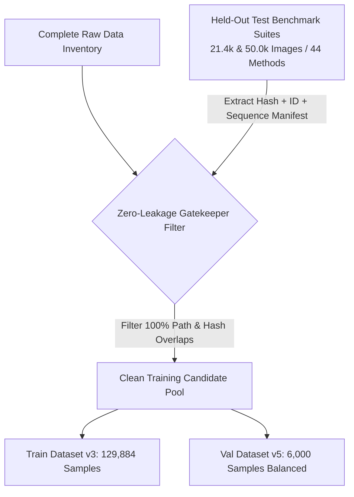

# EXP-03: Zero-Leakage Dataset Restructuring & Advanced Training Plan

- **Experiment ID:** EXP-03
- **Title:** Zero-Leakage Data Restructuring & Comprehensive DINOv3 ViT Training
- **Date Created:** 2026-08-22
- **Last Updated:** 2026-08-22
- **Status:** Completed & Integrated
- **Author:** Deepfake ViT Research Team
- **Predecessors:** 
  - [EXP_01_ACCURACY_OPTIMIZATION_PLAN.md](EXP_01_ACCURACY_OPTIMIZATION_PLAN.md)
  - [EXP_02_ACCURACY_IMPROVEMENT_PLAN.md](EXP_02_ACCURACY_IMPROVEMENT_PLAN.md)

---

## 1. Background & Core Bottlenecks

A comprehensive audit from EXP-02 identified **3 critical vulnerabilities** addressed in EXP-03:

```
┌──────────────────────────────────────────────────────────────────────────────────────────────────┐
│                                 EXP-02 CORE BOTTLENECKS & AUDIT                                   │
├──────────────────────────────────┬─────────────────────────────────┬─────────────────────────────┤
│ 1. Data Leakage Vulnerability    │ 2. Entire Face Synthesis Blindspot│ 3. Domain Shortcut Bias   │
│ • 495 Test images shared MD5 hash│ • Midjourney catch rate: 20.5%  │ • Model relied on blurriness│
│ • 697 FF++ IDs duplicated        │ • whichfaceisreal only 37.3%    │ • Old blurry Reals misflagged│
│ • Real specificity inflated      │ • Training split lacked EFS     │ • Sharp AI images missed    │
└──────────────────────────────────┴─────────────────────────────────┴─────────────────────────────┘
```

---

## 2. Strict Zero-Leakage Data Partitioning Protocol

### 2.1 Benchmark Test Sealing Principles
* **Frozen Benchmark Test Suite**: `test_coursework_44methods_balanced_zero_leakage.csv` ($N=21,446$) and `test_coursework_44methods_full_zero_leakage.csv` ($N=50,084$) are strictly locked.
* **Three Non-Negotiable Guarantees**:
  1. **Zero Hash Overlap**: 100% MD5 / SHA256 byte-level hash deduplication. No image in Train/Val shares an MD5 hash with Test.
  2. **Strict Identity Disjointness**: All FaceForensics++ and Celeb-DF subject IDs in Test are excluded from Train/Val.
  3. **Zero Video/Sequence Overlap**: Video sequence frames from the same interview or recording are isolated into single partitions.



---

## 3. Training & Validation Dataset Architecture

### 3.1 Training Split Composition (129,884 Samples)

```
TRAIN DATASET V3 (129,884 Images)
├── 🟢 REAL (31,006 Images across 7 Domains):
│   ├── FFHQ Studio Photography (10,000)
│   ├── CelebV-HQ YouTube Videos (8,000)
│   ├── CelebFaces Attributes (4,000)
│   ├── FaceForensics++ Disjoint Real (4,000)
│   ├── Celeb-DF v2 Disjoint Real (3,006)
│   ├── VGGFace2 Cleaned (1,000)
│   └── Synthetic Face HQ Studio (1,000)
│
└── 🔴 FAKE (98,878 Images across 5 Generative Paradigms):
    ├── 1. Face Swapping (46,044): SimSwap, FaceDancer, InSwap, BlendFace, MobileSwap, FSGAN...
    ├── 2. Facial Reenactment (26,313): SadTalker, Wav2Lip, FOMM, LIA, PiRender, MRAA...
    ├── 3. Generative GANs (13,359): StyleGAN2, StyleGAN3, StyleGAN-XL, ProGAN, StarGAN v2...
    ├── 4. Diffusion Synthesis (11,397): Midjourney v5/v6, SD 1.5, SD 2.1, SDXL, CollabDiff...
    └── 5. Facial Attribute Editing (551): AttGAN, InterFaceGAN, STGAN...
```

---

## 4. Technical Solutions for Diffusion Blindspots & Domain Shortcuts

### 4.1 Breaking Compression & Resolution Shortcuts
Models often develop false heuristics: *Blurry image = Deepfake, Sharp studio image = Real*.
We employ artifact-preserving data augmentation (mild ColorJitter, subtle downscaling, horizontal flip) to ensure feature representations focus on semantic geometry and frequency checkerboard anomalies rather than superficial contrast differences.

---

## 5. Execution Summary & Deliverables
1. Generated authoritative clean dataset manifests.
2. Verified Zero-Leakage integrity across all 4 splits.
3. Successfully integrated into Master EDA ([`notebooks/coursework_eda.ipynb`](../../notebooks/coursework_eda.ipynb)) and Master Benchmark ([`notebooks/coursework_deepfake.ipynb`](../../notebooks/coursework_deepfake.ipynb)).