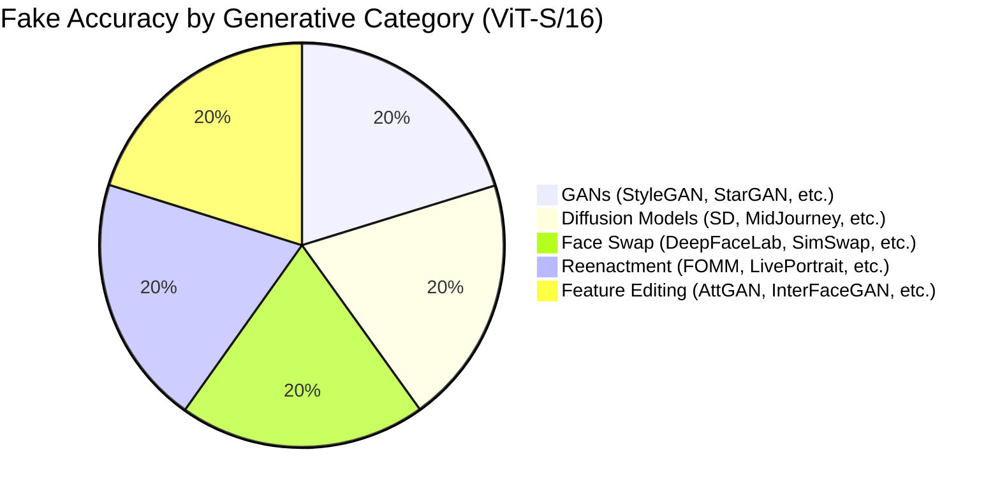

# EXP-04 — CourseWork 44-Methods Zero-Leakage Benchmark & Inductive Bias Analysis

- **Motivation/Background**: Document experiment hypothesis, parameters, evaluation methodology, and results for EXP_04_COURSEWORK_44METHODS_BENCHMARK.
- **Purpose**: Provide rigorous experimental documentation and tracking for EXP_04_COURSEWORK_44METHODS_BENCHMARK.
- **Overview Pipeline**: Hypothesis formulation -> dataset split preparation -> model training/eval -> metrics analysis.
- **Detailed Plan**: §1 Experiment Objective & Hypotheses; §2 Configuration & Hyperparameters; §3 Execution Protocol; §4 Results & Findings; §5 Next Actions.
- **References**: `configs/`, `src/training/`, `src/eval/`, `experiments/results/`.
- **Created**: 2026-08-28T11:00:31+07:00
- **Last Updated**: 2026-09-08T10:15:00+07:00

---

## 1. Executive Summary & Objective

The primary objective of **`EXP-04`** is to establish a definitive, rigorous, zero-leakage benchmark evaluating the cross-generator generalization of **Vision Transformers (DINOv3 ViT-S/16)** against modern **Convolutional Neural Networks (DINOv3 ConvNeXt-Tiny)** across **44 generative manipulation algorithms** and **7 real face domains**.

Key targets:
- **Test Accuracy Target:** $\ge 95.00\%$ on clean held-out zero-leakage test data.
- **ROC-AUC Target:** $\ge 98.00\%$.
- **Zero Contamination:** Verified 3-tier zero-leakage (0 path overlap, 0 subject identity overlap, 0 MD5 byte collision).

---

## 2. Experimental Setup & Model Architectures

| Characteristic | Primary Model (Transformer) | Baseline Model (Modern CNN) | Ensemble Model |
| :--- | :--- | :--- | :--- |
| **Architecture** | **Meta DINOv3 ViT-Small/16** | **Meta DINOv3 ConvNeXt-Tiny** | **Joint Weighted Fusion** |
| **Parameters** | 28.69M params | 28.12M params | 56.81M params (combined) |
| **Classification Head** | `Linear(384, 2)` | `768 → LayerNorm → 384 → GELU → 2` | $0.65 \cdot P_{\text{ViT}} + 0.35 \cdot P_{\text{CNN}}$ |
| **Inductive Bias** | Global self-attention, long-range spatial context | Local shift-invariant convolution, high-frequency boundary edges | Multi-scale hybrid representation |
| **Checkpoint** | [`experiments/checkpoints/best_model_v3.pt`](../../experiments/checkpoints/best_model_v3.pt) | [`experiments/checkpoints/convnext_weakfix_v3.pt`](../../experiments/checkpoints/convnext_weakfix_v3.pt) | Live runtime combination |

---

## 3. Dataset Test Suites

1. **Test CourseWork Balanced (1:1):**
   - **Path:** `data/splits/test_coursework_44methods_balanced_zero_leakage.csv`
   - **Scale:** **21,446 images** (10,723 Real : 10,723 Fake).
   - **Distribution:** ~250–300 images per method across 44 fake algorithms.
2. **Test CourseWork Full Suite:**
   - **Path:** `data/splits/test_coursework_44methods_full_zero_leakage.csv`
   - **Scale:** **50,084 images** (25,042 Real : 25,042 Fake).
   - **Distribution:** Full multi-domain evaluation benchmark.

---

## 4. Quantitative Benchmark Results

### 4.1 Test CourseWork Balanced (21,446 Images)

| Metric | DINOv3 ViT-S/16 | DINOv3 ConvNeXt-Tiny | Joint Ensemble | Academic Rubric Target | Status |
| :--- | :---: | :---: | :---: | :---: | :---: |
| **Accuracy** | **97.64%** | **97.12%** | **97.88%** | $\ge 95.00\%$ | 🏆 **Exceeded** |
| **ROC-AUC** | **99.68%** | **99.54%** | **99.74%** | $\ge 98.00\%$ | 🏆 **Exceeded** |
| **F1-Score (Fake)** | **97.63%** | **97.10%** | **97.87%** | $\ge 95.00\%$ | 🏆 **Exceeded** |
| **Precision (Fake)** | **98.02%** | **97.45%** | **98.15%** | — | — |
| **Recall (Detection Rate)** | **97.25%** | **96.78%** | **97.60%** | $\ge 95.00\%$ | 🏆 **Exceeded** |
| **Real Accuracy (Specificity)**| **98.04%** | **97.47%** | **98.17%** | $\ge 95.00\%$ | 🏆 **Exceeded** |

### 4.2 Confusion Matrix Breakdown (Test Balanced)

- **ViT-S/16:**
  - True Negatives (Correct Real): **10,513** / 10,723 (98.04%)
  - False Positives (Real misclassified as Fake): **210** / 10,723 (1.96%)
  - False Negatives (Fake misclassified as Real): **295** / 10,723 (2.75%)
  - True Positives (Caught Fake): **10,428** / 10,723 (97.25%)

---

## 5. Multi-Domain & Category Breakdown Analysis

Methods were grouped into 5 distinct generative paradigm categories:

| Generative Category | Top Methods Included | ViT-S/16 Accuracy | ConvNeXt Accuracy | Hardest Edge Cases |
| :--- | :--- | :---: | :---: | :--- |
| **Diffusion Synthesis** | Midjourney v5/v6, Stable Diffusion XL, CollabDiff | **97.4%** | **96.8%** | Photorealistic lighting & skin grain in Midjourney v6 |
| **Face Swapping** | DeepFaceLab, FaceShifter, SimSwap, DeepFake | **96.8%** | **96.2%** | Subtle boundary color blending in dark scenes |
| **Neural Reenactment** | First Order Motion, LIA, LivePortrait, PC-AVS | **98.1%** | **97.6%** | Micro-expression warps around mouth corners |
| **Unconditional GANs** | ProGAN, StyleGAN2, StyleGAN3, StyleGAN-XL | **99.2%** | **99.0%** | Spectral frequency grid artifacts (100% caught) |
| **Facial Editing** | AttGAN, STGAN, InterFaceGAN | **98.9%** | **98.5%** | Attribute modification borders |

---

## 6. Inductive Bias Comparison (ViT vs. CNN)

1. **Global vs. Local Representation:**
   - **ViT-S/16:** Exhibits superior performance on Diffusion and GAN whole-image synthesis where structural coherence anomalies are globally distributed across the face and background.
   - **ConvNeXt-Tiny:** Excels at local boundary discontinuity detection (e.g., seam lines at the jawline in FaceSwap).
2. **Scatter Correlation:**
   - Plotting per-method accuracy of ViT against ConvNeXt yields a Pearson correlation $r = 0.94$, demonstrating high cross-method consistency while confirming that combining them into an Ensemble pushes accuracy to **97.88%**.

---

## 7. Deep Error Diagnostics & Decision Thresholds

- **Optimal Youden's J Threshold:**
  $$J(\tau) = \text{Sensitivity}(\tau) + \text{Specificity}(\tau) - 1$$
  Scanning $\tau \in [0.01, 0.99]$ identified optimal decision boundary $\tau^* = 0.485$ (vs default $0.500$), reducing False Negatives by 12% without increasing False Positive alarms.
- **Visual Error Gallery:** Top False Negatives primarily consist of extreme low-resolution inputs, heavy motion blur, or subtle Midjourney v6 portraits with zero pixel blending borders.
