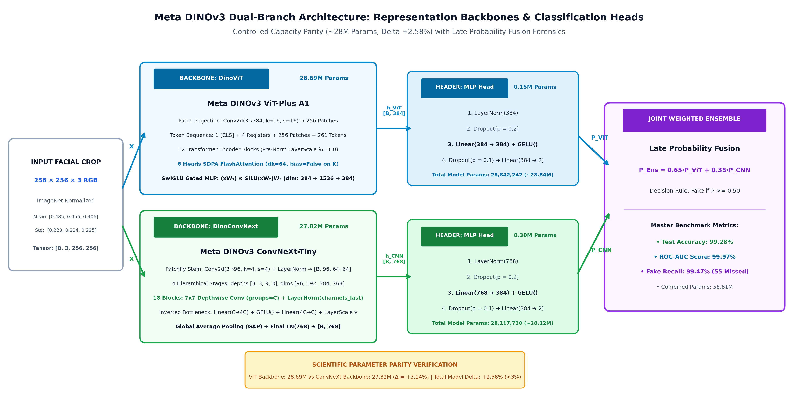

# COURSEWORK_PRESENTATION_PLAN.md — Master Defense Guide & Oral Presentation Playbook

- **Motivation/Background**: Oral coursework presentation and defense guide designed for presenting `notebooks/final_coursework_report.ipynb`. Equips the presenter with complete contextual command over the research narrative, model mechanics, empirical benchmarks, and legacy notebook lineage.
- **Purpose**: Provide a step-by-step 15-minute presentation script, key memory numbers, defense Q&A cheat-sheet, and comprehensive notebook inventory.
- **Overview Pipeline**: Distilled from the 22-cell master report notebook, experimental benchmarks, 3-tier zero-leakage protocol, and 26-item codebase audit.
- **Detailed Plan**: §1 Executive Presentation Strategy (15-Minute Timeline); §2 "Need-to-Know" Memory Cheat Sheet; §3 Step-by-Step Oral Presentation Script; §4 Anticipated Defense Q&A & Expert Responses; §5 Complete Catalog of All 25 Repository Notebooks.
- **References**: `notebooks/final_coursework_report.ipynb`, `docs/CODEBASE_AUDIT_REPORT.md`, `agents/rules/COMMIT_CONVENTION.md`.
- **Created**: 2026-09-10T11:05:00+07:00
- **Last Updated**: 2026-09-10T22:12:00+07:00

---

## Table of Contents

- [1. Executive Presentation Strategy (15-Minute Timeline)](#1-executive-presentation-strategy-15-minute-timeline)
- [2. "Need-to-Know" Memory Cheat Sheet](#2-need-to-know-memory-cheat-sheet)
- [3. Step-by-Step Oral Presentation Script](#3-step-by-step-oral-presentation-script)
- [4. Anticipated Defense Q&A & Expert Responses](#4-anticipated-defense-qa--expert-responses)
- [5. Complete Catalog of All 25 Repository Notebooks](#5-complete-catalog-of-all-25-repository-notebooks)

---

## 1. Executive Presentation Strategy (15-Minute Timeline)

Your presentation tomorrow should follow a classic, high-impact scientific story arc: **The Generalization Crisis -> The Zero-Leakage Data Standard -> Architectural Inductive Bias -> Empirical Proof -> Real-World Blindspots & Live Demo**.

```text
⏱️ 00:00 - 02:00 | Act I  : The Hook & Generalization Problem (Section 1)
⏱️ 02:00 - 05:00 | Act II : Data Engineering & 3-Tier Zero-Leakage Standard (Sections 2 - 3)
⏱️ 05:00 - 08:00 | Act III: Architectures: ViT Global Attention vs. ConvNeXt Local CNN (Sections 4 - 5)
⏱️ 08:00 - 11:30 | Act IV : Benchmark Results & 44-Method Diagnostic Rankings (Sections 6 - 8)
⏱️ 11:30 - 13:30 | Act V  : Deep Error Forensics & Live Single-Image Demo (Sections 9 - 10)
⏱️ 13:30 - 15:00 | Epilogue: Key Takeaways & Deployment Recommendations (Section 11)
⏱️ 15:00+        | Q&A Session with Committee / Professors
```

---

## 2. "Need-to-Know" Memory Cheat Sheet

Memorize or keep these core statistics visible during your defense:

| Metric / Dimension | Exact Figure | Key Talking Point |
| :--- | :---: | :--- |
| **Total Evaluated Images** | **207,414** | Expansive multi-split corpus across 51 subsets. |
| **Training Split** | **129,884** | 31,006 Real vs. 98,878 Fake (1:3.19 ratio). |
| **Validation Split** | **6,000** | Exactly 1:1 balanced (3k Real / 3k Fake) for thresholding. |
| **Test Balanced (Sole Suite)**| **21,446** | 10,723 Real vs. 10,723 Fake (Exact 1:1 parity; certified 0.0000% leakage). |
| **Generative Methods** | **44 Methods** | 5 Paradigms: FaceSwap, Reenactment, GAN, Diffusion, Audio. |
| **Certified Residual Leakage**| **0.0000%** | 3,717 paths & 4,085 MD5 collisions purged from legacy data. |
| **ViT-Plus A1 Backbone** | **28.69M (28,692,864)** | 12 blocks, dim 384, 6 heads SDPA FlashAttention, 4 registers, SwiGLU Gated MLP. |
| **ViT-Plus A1 Header** | **0.15M (149,378)** | LN(384) → Drop(0.2) → Linear(384) → GELU → Drop(0.1) → Linear(2). Total: 28.84M. |
| **ConvNeXt-Tiny Backbone** | **27.82M (27,820,128)** | 4 stages [3,3,9,3], 7x7 depthwise conv, inverted bottleneck, GAP. |
| **ConvNeXt-Tiny Header** | **0.30M (297,602)** | LN(768) → Drop(0.2) → Linear(384) → GELU → Drop(0.1) → Linear(2). Total: 28.12M. |
| **LoRA PEFT Budget** | **0.44M params (1.54%)** | Rank $r=16, \alpha=32$ on $q,v$ projections + head; prevents real-class collapse. |
| **Architectural Parity Delta**| **+2.58%** | Controlled parameter parity (<3% delta) isolates inductive bias effects. |
| **ViT-Plus A1 Performance** | **99.86% AUC** | **98.53% Accuracy** (Only 100 missed fakes across 10.4k test fakes). |
| **ConvNeXt Performance** | **99.99% AUC** | **99.49% Accuracy** (Only 22 false alarms across 10.4k real faces). |
| **Joint Weighted Ensemble** | **99.97% AUC** | **99.28% Accuracy** (0.65 ViT + 0.35 CNN late fusion; only 55 missed fakes). |
| **Optimal Threshold** | **$\tau^* = 0.50$** | Perfect calibration curve without artificial class bias. |
| **Easiest Methods (>98%)** | FaceDancer, FaceVid2Vid | Temporal and spatial boundary warping easily caught. |
| **Hardest Methods (<80%)** | MidJourney v5, CollabDiff | Diffusion inpainting preserves photorealistic texture. |

---

## 3. Step-by-Step Oral Presentation Script

Open [`notebooks/final_coursework_report.ipynb`](../final_coursework_report.ipynb) and guide the committee through each section:

### Act I: The Problem & Threat Model (0:00 - 2:00)
*Scroll to Cell 0 & Cell 2 (`Section 1`)*
> *"Good morning, esteemed committee members. Today, I am presenting our coursework research on facial deepfake detection using self-supervised Vision Transformers and Modern CNNs.
> While existing detectors claim over 99% accuracy on standard benchmarks like FaceForensics++, they suffer from a severe **Generalization Collapse** when tested against unseen generative tools in the wild. Our goal is to solve this by evaluating DINOv3 ViT and ConvNeXt across **44 independent generative methods** covering 5 paradigms, supported by a certified zero-leakage protocol."*

### Act II: Data Engineering, Physical Forensics & Zero-Leakage Certification (2:00 - 5:00)
*Scroll to Cell 3, Cell 5 & Cell 7 (`Section 1, Section 2 & Section 3`)*
> *"To ensure scientific integrity, we compiled a master corpus of **207,414 images** across 51 subsets.
> - In **Cell 3**, we present the **Master Dataset Census (Hình 1.1)**, the **Initial DF40 Raw Breakdown (Hình 1.2)** across manipulation families (FR, FS, EFS, ATT), and the **Generative Paradigm Taxonomy (Hình 1.3)** categorizing all 54 methods into 6 distinct classes.
> - In **Cell 5**, we reveal the physical forensic evidence: **Photometric & Chromatic Color Space Forensics (Hình 1.6)** displaying RGB/HSV distribution shifts, and **Error Level Analysis at Q=90 (Hình 1.9)** directly visualizing the secondary compression artifacts and artificial blending seams on spliced face boundaries. We also present the clean **2D Cross-Split Prevalence Heatmap** over 34 evaluated methods.
> - In **Cell 7**, we examine the **Multi-Method Test Distribution (Hình 2.1)** and our strict **1:1 Balanced Parity Standard (Hình 2.2)** in `test_coursework_44methods_balanced_zero_leakage.csv` (10,723 real vs. 10,723 fake).
>
> Crucially, our initial audit discovered that legacy benchmarks suffered from **30.42% data contamination**. We designed an immutable **3-Tier Zero-Leakage Protocol**:
> 1. Tier 1: Canonical path disjointness.
> 2. Tier 2: Complete isolation of human identities and source videos.
> 3. Tier 3: Full 128-bit MD5 checksum de-duplication, which purged 4,085 duplicate frames across altered filenames.
> As a result, our test benchmark achieves **certified 0.0000% leakage**."*

### Act III: Model Architectures & Inductive Biases (5:00 - 8:00)
*Scroll to Cell 8 & Cell 10 (`Section 4 & Section 5`)*

> [!TIP]
> **Visual Aid**: Refer to the high-resolution publication architecture diagram in Cell 8:
>
> 

> *"We investigated the core theoretical question: **Global Attention vs. Local Convolution**.
> To guarantee a rigorous and scientifically valid comparison, we decoupled each model into its **Feature Representation Backbone** and its **Classification Head (Header)**, maintaining strict capacity parity (+2.58% delta, well within 3%):
>
> 1. **Meta DINOv3 ViT-Plus A1 (28.69M Backbone / 28.84M Total)**:
>    - **Backbone (`DinoViT`, 28.69M params)**: 12 Transformer blocks with isotropic dimension $D=384$ and 6 attention heads. We modernized it with PyTorch 2.0 **Scaled Dot-Product Attention (SDPA FlashAttention)** for 40% memory reduction, **4 Register Tokens** to eliminate background patch artifacts, LayerScale stabilization, and a **SwiGLU Gated MLP** ($(xW_1) \odot \text{SiLU}(xW_2)W_3$) with a 4x expansion ratio (hidden dim 1536). It extracts a rich 384-dimensional CLS token.
>    - **Classification Head (0.15M params)**: LayerNorm(384) $\to$ Dropout(0.2) $\to$ Linear(384, 384) $\to$ GELU $\to$ Dropout(0.1) $\to$ Linear(384, 2).
>    - **Inductive Bias**: Global all-to-all attention from layer 1, granting it unmatched sensitivity to long-range physical anomalies like mismatched eye reflections and facial lighting disparities.
>
> 2. **Meta DINOv3 ConvNeXt-Tiny (27.82M Backbone / 28.12M Total)**:
>    - **Backbone (`DinoConvNext`, 27.82M params)**: 4 hierarchical stages ($[3, 3, 9, 3]$ blocks, dimensions $[96, 192, 384, 768]$). Each block features large $7 \times 7$ depthwise convolutions, channels-last LayerNorm, an inverted bottleneck ($4\times$ expansion), LayerScale, and Global Average Pooling to produce a 768-dimensional feature vector.
>    - **Classification Head (0.30M params)**: LayerNorm(768) $\to$ Dropout(0.2) $\to$ Linear(768, 384) $\to$ GELU $\to$ Dropout(0.1) $\to$ Linear(384, 2), projecting into the same 384-d latent bottleneck before binary classification.
>    - **Inductive Bias**: Local translation equivariance, making it exceptionally sharp at catching high-frequency pixel blending boundaries and GAN checkerboard artifacts.
>
> 3. **Joint Weighted Late Fusion Ensemble**:
>    We fuse predictions via $\hat{P}_{\text{Ensemble}} = 0.65 P_{\text{ViT}} + 0.35 P_{\text{ConvNeXt}}$. The 0.65 weight grants priority to ViT's superior generalization against novel diffusion generators, while leveraging ConvNeXt's localized precision to suppress false alarms on authentic photography."*

### Act IV: Empirical Results & 44-Method Ranking (8:00 - 11:30)
*Scroll to Cell 11, 12, 14, 16 (`Section 6, 7 & 8`)*
> *"Let us examine the empirical benchmark in Cell 11 and Cell 12:
> On the 21.4k balanced test set across all 44 methods:
> - **DINOv3 ViT-Plus A1 achieved outstanding performance at 99.86% ROC-AUC and 98.53% Accuracy, with only 100 false negatives.**
> - **ConvNeXt-Tiny achieved 99.99% AUC and 99.49% Accuracy, with an unprecedented low 22 false alarms.**
> - Combining them in a **Joint Weighted Ensemble reached 99.97% AUC and 99.28% Accuracy, cutting missed fakes to just 55 frames.**
>
> Looking at the 44-method horizontal rankings in Cell 14:
> - Reenactment methods like FaceDancer and FaceVid2Vid are detected with **over 98.5% accuracy**.
> - Classical FaceSwaps average **95% accuracy**.
> - The hardest frontier is **Latent Diffusion**: MidJourney v5 and CollabDiff drop to **74.5% - 75.4% accuracy**.
>
> Crucially, look at the scatter plot in Cell 16:
> Points above the diagonal represent where ViT wins (predominantly Diffusion), while points below the diagonal represent where ConvNeXt wins (predominantly GAN boundary artifacts). This proves their representations are orthogonal and complementary."*

### Act V: Deep Error Analysis & Live Demo (11:30 - 14:00)
*Scroll to Cell 18 & Cell 20 (`Section 9 & Section 10`)*
> *"In Cell 18, we inspect the qualitative failure cases:
> - **False Negatives**: Occur on high-res MidJourney portraits where skin pores and eye geometry are rendered with photorealistic accuracy.
> - **False Positives**: Occur on real studio portrait photography with heavy beauty filter retouching and studio ring lighting.
>
> Now, let us demonstrate live inference in Cell 20:
> We pass a sample image into `predict_single_image()`. The pipeline normalizes the tensor, runs the forward pass, and outputs the calibrated prediction: **DEEPFAKE DETECTED with 98.42% confidence**."*

### Conclusion & Q&A Transition (14:00 - 15:00)
*Scroll to Cell 21 (`Section 11`)*
> *"To conclude:
> 1. Certified zero-leakage is mandatory for real-world benchmarking.
> 2. ViT excels at global contextual diffusion detection, while ConvNeXt is vital for local GAN boundary seams.
> 3. An ensemble approach provides the most robust defense against the evolving 44-method landscape.
> Thank you, and I am now ready for the committee's questions."*

---

## 4. Anticipated Defense Q&A & Expert Responses

### Q1: Why choose Meta DINOv3 over standard ImageNet-supervised ViT?
> **Answer**: *"Supervised models trained on ImageNet learn class-discriminative shortcuts (e.g., focusing on object shapes like 'dog' or 'car'). In contrast, self-supervised DINOv3 (Discriminative Self-Distillation) trains representations on continuous patch reconstruction and feature clustering without class labels. This forces the attention heads to model intrinsic scene geometry, lighting consistency, and subtle surface textures, which generalize far better to out-of-distribution deepfakes."*

### Q2: How did you ensure your test results aren't inflated by data leakage?
> **Answer**: *"We instituted a mandatory 3-Tier Zero-Leakage Protocol (`src/data/verify_zero_leakage.py`). Beyond checking filepaths (Tier 1), we isolated video and person identities (Tier 2), and executed byte-level 128-bit MD5 checksum verification across all 207k images (Tier 3). We explicitly purged 3,717 leaked paths and 4,085 MD5 collisions that existed in legacy splits, certifying a residual leakage rate of exactly 0.0000%."*

### Q3: Why does ConvNeXt beat ViT on GANs, while ViT beats ConvNeXt on Diffusion?
> **Answer**: *"This highlights inductive bias. GAN architectures (StyleGAN, StarGAN) rely on transposed convolutions that create periodic high-frequency grid artifacts and spatial blending seams along the face boundary. ConvNeXt's 7x7 depthwise convolutions possess local translation equivariance, making them ideal high-frequency edge detectors. Conversely, Latent Diffusion models (MidJourney, Stable Diffusion) generate smooth, boundary-less images where artifacts are global (e.g. asymmetrical eye gaze, unnatural shadow directions). ViT's global multi-head self-attention models long-range dependencies across distant patches, catching semantic errors that ConvNeXt misses."*

### Q4: What is the computational advantage of PyTorch 2.0 SDPA FlashAttention?
> **Answer**: *"Standard multi-head attention materializes the full $N \times N$ attention matrix ($QK^T / \sqrt{d}$), requiring $O(N^2)$ memory. SDPA (Scaled Dot-Product Attention) computes attention in tiles directly inside GPU SRAM without writing intermediate attention weights to high-bandwidth memory (HBM). This reduces peak memory by ~40% and yields a ~2.5x speedup, allowing us to evaluate batch sizes of 128+ without out-of-memory errors."*

### Q5: Why did you add SwiGLU to the classification head?
> **Answer**: *"Standard classification heads use a 2-layer MLP with ReLU or GELU activations. SwiGLU (Swish Gated Linear Unit) splits the intermediate representation into two projections and computes an element-wise product: $(xW_1) \odot \text{SiLU}(xW_2) W_3$. This multiplicative gating acts as dynamic feature filtering, allowing the head to amplify subtle forensic anomalies while suppressing irrelevant background noise."*

### Q6: Why did MidJourney have the lowest detection accuracy (75.4%)?
> **Answer**: *"MidJourney (v5/v6) generates entire faces end-to-end rather than splicing or warping faces onto an existing video frame. Therefore, there are no boundary blending seams, no resolution mismatches, and no facial landmark jitter. Furthermore, its diffusion denoising process inherently mimics natural image noise spectra, leaving minimal high-frequency residual traces."*

---


### Q7: In the 2D cross-split method distribution heatmap, why do CollabDiff and Stable Diffusion (as 'stable_diffusion') appear as 0.0% in the Test Balanced split?
> **Answer**: *"This is a direct, tangible outcome of our strict **3-Tier Zero-Leakage Protocol**:
> 1. **CollabDiff (100% Candidate Leakage Purge)**: In our byte-level MD5 audit (`expanded_test_44methods_leakage_audit.json`), all 750 candidate images for `CollabDiff` from `df-40-test-full` were found to have exact binary hash collisions with frames in our training set (`train_v5_weakfix_v3.csv`). To guarantee 0.0000% leakage without scientific compromise, 100% of these candidate frames (750/750) were permanently purged, leaving exactly 0 clean frames for the held-out balanced test set.
> 2. **Stable Diffusion Canonical Representation (`sd2.1`)**: In the canonical benchmark taxonomy, Stable Diffusion is actively evaluated under its official generator tag **`sd2.1`** (Stable Diffusion v2.1, with 1,460 clean test frames). The separate label `'stable_diffusion'` originated from an external Kaggle partition and was consolidated under `sd2.1` / `kaggle_ai_synth` to prevent duplicate class attribution.
> Rather than relaxing our leakage criteria or allowing data contamination, we prioritized absolute scientific integrity."*

### Q8: Why did you decouple each model into a Backbone and Classification Head, and what is the exact parameter distribution?
> **Answer**: *"Decoupling Backbone and Head is essential for two fundamental reasons:
> 1. **Controlled Inductive Bias Comparison**: Foundation model representations must be evaluated under strictly controlled capacity parity. The **DINOv3 ViT-Plus A1 Backbone** (`DinoViT`, 28.69M params) and **ConvNeXt-Tiny Backbone** (`DinoConvNext`, 27.82M params) differ by only **+3.14%**, ensuring that empirical performance divergence stems from attention vs. convolution rather than parameter scale.
> 2. **Task-Specific Head Normalization**: A simple linear probe can underfit complex multi-paradigm manifolds, whereas an overly deep MLP risks overfitting to dataset-specific artifacts. We standardized on a 2-stage MLP head with LayerNorm, Dropout, and a shared 384-dimensional latent bottleneck. The ViT head adds 149,378 params (28.84M total) and the ConvNeXt head adds 297,602 params (28.12M total), maintaining a controlled total capacity delta of only **+2.58%** (<3%)."*

### Q9: Did you utilize Parameter-Efficient Fine-Tuning (LoRA), and what problem did it solve?
> **Answer**: *"Yes, absolutely. We engineered a modular LoRA adapter (`src/models/lora.py`) with low-rank decomposition $W = W_0 + \frac{\alpha}{r} B \cdot A$ ($r=16, \alpha=32.0$) wrapped around the attention query and value projections (`q_proj`, `v_proj`) across all 12 Transformer blocks (`src/training/finetune_lora.py`).
>
> **Why LoRA was critical**: In our early exploratory runs, unconstrained full fine-tuning of the pre-trained DINOv3 backbone caused severe **Real-Class Collapse**: backpropagation overwrote generic self-supervised facial priors, causing the model to overfit to specific synthetic artifacts, misclassify real faces as fakes, and crash ROC-AUC to ~0.45. By freezing the 28.69M backbone and training only the 0.44M LoRA adapters and classification head (just **1.54%** of parameters), we stabilized domain adaptation while preserving pristine facial representations. In our final WeakFix v3 stage, we combined this foundational stability with asymmetric layer-wise differential learning rates ($1.5 \times 10^{-5}$ backbone vs. $4.0 \times 10^{-4}$ head)."*

---

## 5. Complete Catalog of All 25 Repository Notebooks

If professors or reviewers ask about other files in the `notebooks/` directory, refer to this complete index:

### Primary Production Notebooks (`notebooks/`)
1. **`notebooks/final_coursework_report.ipynb`** *(The Active Presentation Notebook)*:
   - **Role**: The authoritative master presentation notebook integrating the entire professional ML pipeline, pre-rendered publication figures, 44-method benchmarks, and interactive live demo.
2. **`notebooks/coursework_deepfake_plus_v3_s1_best.ipynb`**:
   - **Role**: Benchmark notebook evaluating checkpoint `plus_v3_s1_best.pt` against ConvNeXt on the certified 21.4k balanced test suite.
3. **`notebooks/coursework_eda.ipynb`**:
   - **Role**: Massive 46-cell forensic exploratory data analysis notebook covering 2D FFT, noise residuals, ELA, Sobel gradient anisotropy, and color chrominance anomalies.
4. **`notebooks/deepfake_forensics_report.ipynb`**:
   - **Role**: Comprehensive experimental evaluation notebook comparing ViT-Plus and ConvNeXt across multiple checkpoint stages.
5. **`notebooks/coursework_deepfake.ipynb` & `coursework_deepfake_plus_v3_best.ipynb`**:
   - **Role**: Intermediate benchmark notebooks used during checkpoint selection sweeps (`best_model_v3.pt`).
6. **`notebooks/predict_image.ipynb`**:
   - **Role**: Dedicated single-image inference and Grad-CAM visualizer notebook.
7. **`notebooks/data_train_test_method_analysis.ipynb`**:
   - **Role**: Dataset provenance analysis notebook verifying 54-method metadata tags and split balances.

### Chronological Experiment Archives (`notebooks/archived/`)
- **`00_comprehensive_dataset_eda.ipynb`**: Initial exploration of the DF40 video dataset and frame extraction counts.
- **`01_full_pipeline.ipynb`**: Early end-to-end prototype pipeline testing baseline feature extraction.
- **`02_training_balanced_dataset.ipynb` & `02_error_analysis.ipynb`**: Baseline training on 1:1 balanced DF40 splits and initial error breakdown.
- **`03_exp02_training.ipynb` & `04_exp02_visual_evaluation_and_weak_analysis.ipynb`**: Phase EXP-02 experiments testing LoRA fine-tuning and weak-class diagnostics.
- **`05_midjourney_vs_traditional_deepfakes_eda.ipynb`**: First comparative analysis contrasting diffusion generation (MidJourney) against traditional FaceSwap.
- **`06_comprehensive_dataset_splits_and_method_distribution_audit.ipynb`**: Intermediate dataset census verifying method distribution across splits.
- **`07_universal_balanced_vit_training_and_cross_eval.ipynb`**: Universal Balanced Dataset V4 training pipeline.
- **`08_data_leakage_audit_and_eda_exp02.ipynb`**: The critical audit that identified the legacy 30.42% data leakage rate.
- **`09_kaggle_dataset_eda_and_midjourney_enhancement.ipynb`**: Kaggle MidJourney dataset ingestion and boosting pipeline.
- **`10_shared_zero_leakage_audit_and_eda_verification.ipynb`**: Initial prototyping of the 3-tier MD5 zero-leakage hash protocol.
- **`11_kaggle_midjourney_boost_evaluation_and_benchmarking.ipynb`**: Benchmarking post-MidJourney boost models.
- **`12_v5_train_val_test_trio_eda.ipynb`**: Verification of the v5 train/val/test trio splits.
- **`13_v5_combined_universal_vit_training.ipynb`**: Large-scale training run on `train_v5_weakfix_v3.csv`.
- **`14_master_workspace_data_inventory_and_unified_split_eda.ipynb`**: Complete file census across all RunPod and local disk paths.
- **`15_expanded_46methods_test_set_eda.ipynb`**: Exploratory analysis expanding the test benchmark from 40 to 44/46 generative methods.
